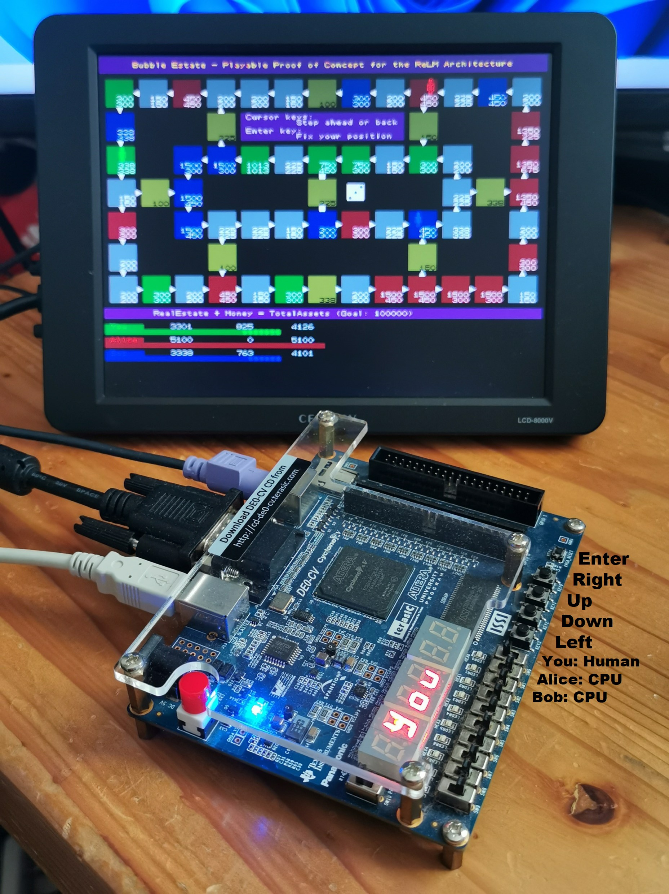

# ReLMの紹介

ReLM = Register-Less Multiprocessor

ReLMは独自のメモリアーキテクチャによるソフトコアマルチプロセッサで、比較的小型なFPGA上に高性能なマイクロコントローラを構築することが可能です。

FPGA上の開発で最も負荷が大きいのが論理合成ですが、ソフトウェアの変更に関しては論理合成が不要なので、FPGAにおける回路設計のサポートツールとして利用することも可能です。

## Software Requirements

* Windows
* Python
* Quartus Prime
* Visual Studio Code（推奨）

## Hardware Requirements

* Host PC
* [Terasic DE0-CV Board](https://www.terasic.com.tw/cgi-bin/page/archive.pl?Language=English&CategoryNo=183&No=921)
* VGA monitor
* PS/2 keyboard (option)

## Getting Started - Playable PoC "Bubble Estate"

1. __de0cv / relm_de0cv.py__
   * relm_de0cv.py を実行。
   * de0cv / loader フォルダに code??.txt, data??.txt が作成される。
2. __de0cv / loader / relm_de0cv.qpf__
   * relm_de0cv.qpf でQuartus Primeを起動し、論理合成。
   * de0cv / loader / output_files / relm_de0cv.svf が作成される。
3. __de0cv / loader / relm_test_led.py（省略可能）__
   * relm_test_led.py を実行。
   * FPGAボード上のLEDに HELLO_ と表示されることを確認。
   * この操作は省略可能。
4. __de0cv / bubble / relm_bubble.py__
   * relm_bubble.py を実行。
   * FPGAボード上のLEDに PLAY と表示されることを確認。
   * VGAディスプレイを接続すれば、ゲームが遊べる。
   * PS/2キーボードを接続すれば、より遊びやすい。

最初に２ページのゲーム説明があり、Enter でゲーム開始。

PS/2キーボード接続が望ましいが、本体ボタンでも代用可能。

本体スイッチで Human / CPU の切り替えが可能。（SW0 が You の切り替え）

ゲーム実行イメージ

## For Further Reading...

* ReLMの紹介 (English) [(Japanese)](relm_j.md)
* ReLM命令セット (English) [(Japanese)](relm_isa_j.md)
* ReLM開発環境 (English) [(Japanese)](relm_sdk_j.md)
* ReLMアプリケーション開発 (English) (Japanese)
* ReLMカスタマイズ (English) (Japanese)
* [Python API Reference (English)](relm_api.md)

Very Old Article...
* [relm.info - Register-less Multiprocessor Information (English)](http://relm.info/en/) [(Japanese)](http://relm.info/)
