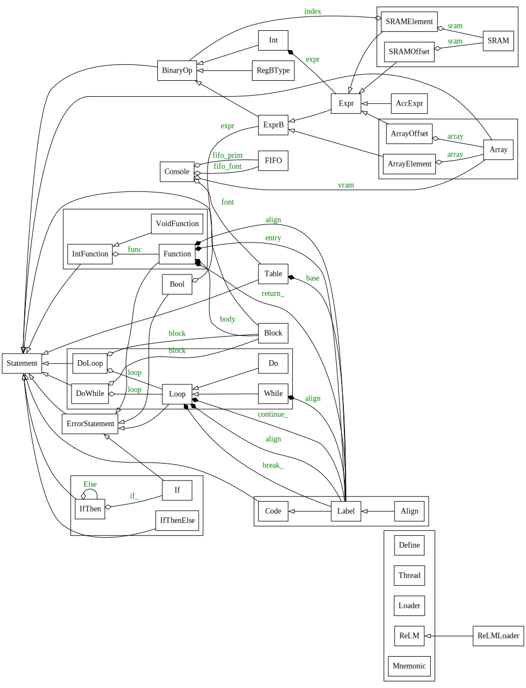

# Python API Reference

## Class Diagram

## ReLMLoader

__with ReLMLoader( *release, dump=True, loader=False, release_loader=False ):__
* __*release__  
Folder path to create the memory image files (code??.txt, data??.txt).  
\_\_file\_\_: Create it in the same folder as the Python code.
* __dump=Tree__  
False: Suppress dump output.
* __loader=False__  
SVF file path: Configure FPGA by SVF file and send program code to the FPGA via JTAG.  
True: Send program code to the FPGA via JTAG.  
False: Create the memory image files.
* __release_loader=False__  
True: Include the program loader in the memory image.

## Block

* __definition block__  
Define[ body ]
* __thread block__  
Thread[ body ]
* __loader block__  
Loader[ body ]
* __block object__  
block := Block[ body ]

## Variable

* __signed integer definition__  
var := Int()  
var := Int( expr )
* __unsigned integer definition__  
var := UInt()  
var := UInt( expr )
* __assignment__  
var( expr )

## Conditional

* __if-then__  
If( cond )[ body ]
* __if-then-else__  
If( cond )[ body ].Else[ body ]

## Loop

* __loop__  
Do()[ body ]
* __do-while__  
Do()[ body ].While( cond )
* __while__  
While( cond )[ body ]
* __continue__  
Continue()
* __break__  
Break()

## Function

* __function returns value__  
func := Function(p1 := Int(), p2 := Int(), ...)[ body ].Return( expr )
* __void function__  
func := Function(p1 := Int(), p2 := Int(), ...)[ body ]
* __return value__  
Return( expr )
* __return__  
Return()
* __function call__  
func(p1, p2, ...) -> expr

## Jump Table

* __definition__  
table := Table( size )
* __register case__  
table.Case( index, ... )
* __register default__  
table.Default()
* __return from case__  
table.Return()
* __switch to case__  
table.Switch( expr, acc ) -> expr

## FIFO

* __allocation__  
fifo := FIFO.Alloc( size=0 )
* __empty check__  
fifo.IsEmpty() -> cond
* __pop__  
fifo.Pop() -> expr
* __push__  
fifo.Push( expr, ... )
* __lock (no empty check after this)__  
fifo.Lock()

### Array
* __definition__  
array := Array( *data, op="PUSH" )
* __read__  
array[ expr ] -> expr
* __write__  
array\[ expr ]( expr )

## SRAM

* __allocation__  
sub := sram.Alloc( size )
* __read__  
sram[ expr ] -> expr
* __write__  
sram\[ expr ]( expr, ... )

## Array vs SRAM

Array
* Allocated on code memory
  * Consume code memory
* Thread safe
* Random access reading is slow
* Can be used for burst I/O transfer

SRAM
* I/O accessible memory device 
  * Not consume code memory
* Not thread safe
* Random access reading is fast
* Sequential writing is available
  * Can be used for initialization
  * But consume code memory

## Intrinsic (Register Access)

* __get accumulator__  
Acc  
AccU
* __set accumulator__  
Acc( expr )  
AccU( expr )
* __get register B__  
RegB  
RegBU
* __set register B__  
RegB( expr, acc=0 )  
RegBU( expr, acc=0 )
