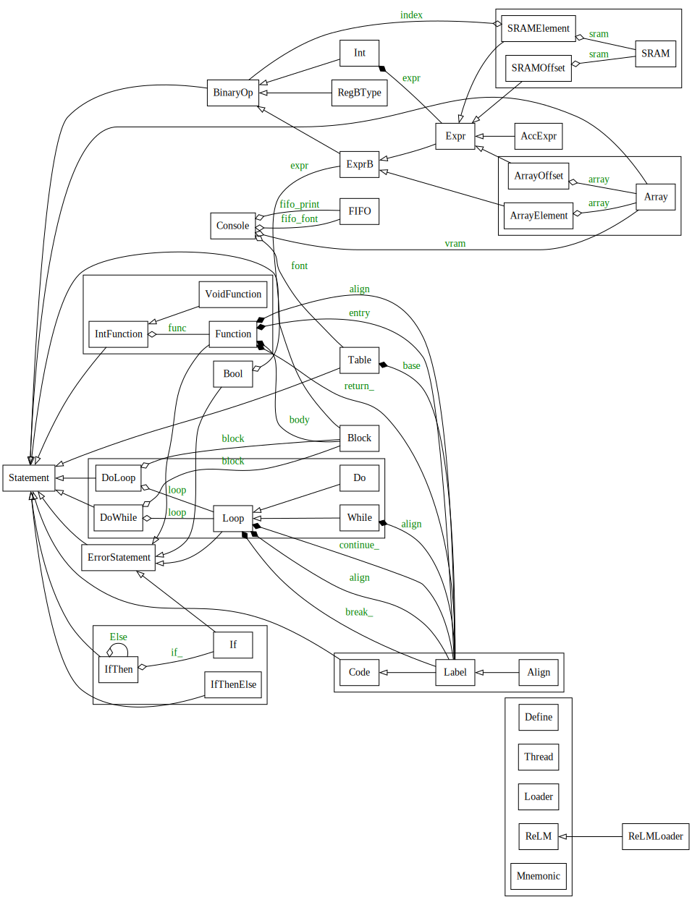

# ReLMアプリケーション開発

ReLM環境でのアプリケーション開発について、Playable PoCの"Bubble Estate"を例に説明します。

## スタンドアロン構成ビルド

Bubble Estate本体のrelm_bubble.pyの冒頭は、以下の様になっています。

~~~ py
loader = "loader/output_files/relm_de0cv.svf" if __name__ == "__main__" else False

with ReLMLoader(__file__, loader=loader):
~~~

これは、relm_bubble.pyをメインとして実行した場合、loaderパラメータにSVFファイルが指定されますので、ホストPCからローダーを通してBubble Estateのコードを送り込んで実行する流れになります。

もう一つ、relm_bubble_release.pyというファイルがありますが、その中身は以下の一行のみです。

~~~ py
import relm_bubble
~~~

こちらをメインとして実行すると、relm_bubble.pyの方では \_\_name\_\_ == "\_\_main\_\_" とはならないので、loader=Falseとして実行することになります。

この場合、最初に \_\_file\_\_ が指定されているのでローダーを実行せずにコンパイルのみを行い、結果を同じフォルダにメモリイメージ code??.txt, data??.txt として出力します。

同じフォルダにQuartus Primeのプロジェクトファイルrelm_bubble.qpfが既にありますので、これを起動して論理合成を実行すると、ホストPCを必要としない、スタンドアロン構成のBubble Estateがビルドされます。

この結果出力されたPOFファイルの内容をFPGAボードのROMに書き込めば、ホストPCに接続しなくても電源投入ですぐにBubble Estateが立ち上がるスタンドアロン構成のシステムが完成します。

このQuartus Primeプロジェクトの設定ではVerilog HDLマクロとして __NO_LOADER__ が指定されていますので、この場合、ローダー関連のデバイスJTAG, PUTOPが論理合成結果から削除されます。

## コンソール出力

ディスプレイ出力が可能なハードウェア構成では、文字列出力の機能があると、開発中のデバッグで非常に便利です。

コンソール出力のための必要最小限の実装例は、relm_test_vga.pyにあります。

~~~ py
    Thread[
        Acc("VGA"),
        Do()[vram := Array(*([0xFEDCBA98] * 80 * 480))],
    ]
    console = Console(vram, 80, FIFO.Alloc(), FIFO.Alloc())
    Thread[console.Service()]
~~~

relm_bubble.pyではvram周りが若干複雑になっていますが、垂直同期タイマー（vsync）とカラーパレットによる点滅（blink）によるものです。

relm_bubble.pyのコンソールスレッド

~~~ py
    Thread[
        Out(
            "VGAPAL",
            0x0000,
            0x8881,
            0x8802,
            0x8003,
            0x0804,
            0x0085,
            0xFF06,
            0xF007,
            0x0F08,
            0x00F9,
            0x808E,
            0xFFFF,
        ),
        blink := Int(0),
        Do()[
            RegB(Acc, "VGA"),
            vram := Array(*([0] * (80 * 480))),
            vsync := Int(Acc),
            If((RegB + 1) & 0x1F == 0)[
                b1 := Int(blink),
                b0 := Int(Acc & 0xF),
                Out("VGAPAL", b0),
                Acc(0),
            ].Else[
                If(Acc ^ 0x10 == 0)[
                    Out("VGAPAL", b1),
                    Acc(0),
                ],
                Acc ^ 0x10,
            ],
        ],
    ]
    console = Console(vram, 80, FIFO.Alloc(), FIFO.Alloc())
    Thread[console.Service()]
~~~

 

consoleオブジェクトの使い方の例はrelm_test_vga.pyを見るのが最も分かりやすく、例えば以下の様なパラメータでPrintメソッドを呼び出します。

~~~ py
        console.Print("@ABCDEFGHIJKLMNOPQRSTUVWXYZ[\\]^_", pos=640 * 5, color=0xF0),
        console.Print("@ABCDEFGHIJKLMNOPQRSTUVWXYZ[\\]^_", pos=640 * 6, color=0x0F),
~~~

posは文字を描き始める位置で、１行80文字で、縦方向に８ピクセル分下げると 80 x 8 = 640 が１行分になります。

posを省略すると、前回描いた位置から続けて描き始めます。

colorはフォントのカラーインデックスで、上位４ビットがフォアグラウンド、下位４ビットがバックグラウンドとなります。

colorも省略可能で、その場合は以前指定したカラーインデックスを引き継ぎます。

console.Printメソッドの中身は以下になっていて、FIFOへのPushを行うコードを内包するBlockオブジェクトを返します。

~~~ py
    def Print(
        self,
        text: str,
        pos: int | BinaryOp | None = None,
        color: int | BinaryOp | None = None,
    ) -> Block:
        p = []
        if pos is not None:
            p.append(pos | 0x80000000)
        if color is not None:
            p.append(color | 0xC0000000)
        while text:
            p.append(sum(ord(ch) << (i * 8) for i, ch in enumerate(text[:4])))
            text = text[4:]
        return Block[self.fifo_print.Push(*p)]
~~~

実際のテキストはFIFOに最大４文字単位でパックして送出され、posやcolorは最上位ビットに特殊なフラグが付けられたコードとして送出されています。

FIFOの受け取り側はサービススレッドで、実装は以下になります。

~~~ py
    def Service(self) -> Block:
        return Block[
            pos := Int(),
            color_fg := Int(),
            color_bg := Int(),
            self.fifo_font.Lock(),
            self.fifo_print.Lock(),
            Do()[
                If(RegB(self.fifo_print.Pop(), 0x80000000).opb("AND") == 0)[
                    text := Int(RegB),
                    While(text != 0)[
                        self.PutChar(pos, text & 0x7F, color_fg, color_bg),
                        pos(pos + 1),
                        text(text >> 8),
                    ],
                    Continue(),
                ],
                If(RegB & 0x40000000 == 0)[pos(RegB & 0x3FFFFFFF), Continue()],
                bg := Int(RegB & 0xF),
                color_bg(Acc * 0x11111111),
                color_fg(((RegB & 0xF0) >> 4) - bg),
            ],
        ]
~~~

レジスタ（B）のintrinsicが若干多めですが、最上位ビットのフラグに応じて条件分岐していることが何となく読み取れるかと思います。

文字表示の主要な処理はPutCharメソッドになります。

~~~ py
    def PutChar(
        self,
        pos: int | BinaryOp,
        ch: int | BinaryOp,
        fg: int | BinaryOp,
        bg: int | BinaryOp,
    ) -> Block:
        return Block[
            self.font.Switch(ch, acc=self.fifo_font.port),
            self.vram[pos](self.fifo_font.Pop() * fg + bg),
            RegB(RegB + self.width, self.fifo_font.Pop() * fg + bg).opb("PUT"),
            RegB(RegB + self.width, self.fifo_font.Pop() * fg + bg).opb("PUT"),
            RegB(RegB + self.width, self.fifo_font.Pop() * fg + bg).opb("PUT"),
            RegB(RegB + self.width, self.fifo_font.Pop() * fg + bg).opb("PUT"),
            RegB(RegB + self.width, self.fifo_font.Pop() * fg + bg).opb("PUT"),
            RegB(RegB + self.width, self.fifo_font.Pop() * fg + bg).opb("PUT"),
            RegB(RegB + self.width, self.fifo_font.Pop() * fg + bg).opb("PUT"),
        ]
~~~

この正体も実は一つのBlockオブジェクトになります。

Block内の処理の流れは、冒頭のfont.SwitchでFIFOにフォント情報を格納し、フォント情報を読み出しながらVRAMに文字色を適用したデータを書き込んでいます。

このfontは文字出力のためのフォントテーブルで、その実体はrelm.pyで標準的に定義されているTableオブジェクトで、[switch文](https://ja.wikipedia.org/wiki/Switch%E6%96%87)と同様の[テーブルジャンプ](https://ja.wikipedia.org/wiki/%E3%83%86%E3%83%BC%E3%83%96%E3%83%AB%E3%82%B8%E3%83%A3%E3%83%B3%E3%83%97)を構築します。

フォントの定義はrelm_font.py内にありますが、以下の様にSwitch-CaseのCase側の実装になります。

~~~ py
    font8x8 := Table(128),
    font8x8.Default(),
    Array(
        0x00000000,
        0x00000000,
        0x00000000,
        0x00000000,
        0x00000000,
        0x00000000,
        0x00000000,
        0x00000000,
    ),
    font8x8.Return(),
    font8x8.Case(ord("!")),
    Array(
        0x00010000,
        0x00010000,
        0x00010000,
        0x00010000,
        0x00010000,
        0x00000000,
        0x00010000,
        0x00000000,
    ),
    font8x8.Return(),
    font8x8.Case(ord('"')),
    Array(
        0x00101000,
        0x00101000,
        0x00000000,
        0x00000000,
        0x00000000,
        0x00000000,
        0x00000000,
        0x00000000,
    ),
    font8x8.Return(),
~~~

Case側の実装はフォントデータのArrayと呼び出し元に戻るReturnとなります。

Arrayは実際にはPUSH命令の列となりますので、呼び出し側のSwitchでアキュムレータ（Acc）にFIFOのポート番号を指定すると、FIFO内にフォントデータを受け取ることができます。

~~~ py
            self.font.Switch(ch, acc=self.fifo_font.port),
~~~

呼び出し元の戻り番地はレジスタ（B）に格納されていますので、Returnの実体はOPB JUMPという命令コードになります。

~~~ py
    def Return(self) -> Code:
        return Code("OPB", "JUMP")
~~~

このフォントテーブルは一度生成したらその後は変更できないというわけではなく、後で好きなだけ追加することが可能です。

実際、Bubble Estateでは空いている文字コードに新たなフォントを割り当てて使用しています。

~~~ py
        font8x8.Case(ord("\x01")),
        Array(
            0x11111111,
            0x11111111,
            0x01111110,
            0x01111110,
            0x00111100,
            0x00111100,
            0x00011000,
            0x00011000,
        ),
        font8x8.Return(),
        font8x8.Case(ord("\x02")),
        Array(
            0x00000011,
            0x00001111,
            0x00111111,
            0x11111111,
            0x11111111,
            0x00111111,
            0x00001111,
            0x00000011,
        ),
        font8x8.Return(),
~~~

## Pythonクラスの利用

このコンソール出力機能の様に、コンパイル時に静的に生成される[モジュール](https://ja.wikipedia.org/wiki/%E3%83%A2%E3%82%B8%E3%83%A5%E3%83%BC%E3%83%AB)に関しては、Pythonクラスを利用して処理を[カプセル化](https://ja.wikipedia.org/wiki/%E3%82%AB%E3%83%97%E3%82%BB%E3%83%AB%E5%8C%96)することが比較的容易です。

以下はReLM開発環境を[Pyreverse](https://pylint.readthedocs.io/en/latest/pyreverse.html)に掛けた出力を少し手直ししたクラス図ですが、大部分のクラスがStatementのサブクラスになっていることがわかります。

Python API クラス図

 

Statementクラスはバイナリコード生成のための[インタフェース](https://ja.wikipedia.org/wiki/%E3%82%A4%E3%83%B3%E3%82%BF%E3%83%95%E3%82%A7%E3%83%BC%E3%82%B9_(%E6%83%85%E5%A0%B1%E6%8A%80%E8%A1%93)#%E3%82%BD%E3%83%95%E3%83%88%E3%82%A6%E3%82%A7%E3%82%A2%E3%82%A4%E3%83%B3%E3%82%BF%E3%83%95%E3%82%A7%E3%83%BC%E3%82%B9)となっていて、サブクラスではこれらのメソッドを[オーバーライド](https://ja.wikipedia.org/wiki/%E3%82%AA%E3%83%BC%E3%83%90%E3%83%BC%E3%83%A9%E3%82%A4%E3%83%89)して実装します。

~~~ py
class Statement:
    def render(self, codes: list[Code]) -> list[Code]:
        raise SyntaxError("broken statement")

    def terminal(self) -> bool:
        return False
~~~

従って、DefineやThreadブロック、あるいはIf()文の本体といったコードブロックでは、Statementのサブクラスのみが記録され、それ以外は無視されます。

ただし、If()文の処理本体が抜けている場合（Ifクラス）や a < 100 といった比較条件式がコードブロックにそのまま置かれている場合（Boolクラス）は、明らかにコーディングミスと考えられますので、ErrorStatementのサブクラスとしてエラーチェックの対象となります。

自前のクラスでReLMのバイナリコードを出力したい場合、必ずしもStatementのメソッドを実装する必要はありません。

むしろ、メソッドの戻り値として既存のプリミティブを使い分けた方が、より自然に処理を記述できます。

例えば、FIFOクラスはStatementのサブクラスではありませんが、以下のメソッドの戻り値として異なる型のプリミティブを返しています。

~~~ py
    def IsEmpty(self, load: str = "LOAD") -> Bool:
        assert not self.locked, "FIFO is locked"
        return IO(self.port, 0x0, load=load, op="POP") == 0

    def Pop(self, unsigned: bool = False, load: str = "LOAD") -> Expr:
        if self.locked:
            return In(self.port, unsigned=unsigned, op="POP")
        else:
            return IO(self.port, 0x1, unsigned=unsigned, load=load, op="POP")

    def Push(self, *value: int | str | BinaryOp, load: str = "LOAD") -> Block:
        return Out(self.port, *value, load=load, op="PUSH")
~~~

まずIsEmptyメソッドですが、条件式としてBool型の値を返しています。

こうすることで、If()やWhile()の条件式として使用することを強制できます。

Popメソッドの戻り値は、式の中で利用できるようにExpr型で返しています。

式として利用できる型としてはExprBとExprがありますが、ExprはExprBのサブクラスで、レジスタ（B）を変更しないと判っている計算式のみをExpr型とします。

Pushメソッドは式の中で使われることはなく、あくまでも実行文としての使用に限定されますので、Block型のオブジェクトを返しています。

## スレッド間通信と排他制御

複数のスレッドが協調する処理を構築したい場合、FIFOの利用がまず第一の候補となります。

FIFOは送信側と受信側が別々のスレッドで非同期的に使用しても安全なことが保障されており、書き込みから読み出しへのタイムラグも小さく抑えられることから効率上も有利になります。

ただし、FIFOが安全に使用できるのはあくまでも一対一のスレッド間通信に限定されており、多対一、一対多、あるいは多対多の場合、何らかの排他制御が必要になります。

FIFOに対して複数のスレッドで同時にPushを実行した場合、本来は全てのデータが別々にPushされることが望ましいのですが、実際には全てのデータの論理和が一つだけPushされます。

同様にFIFOに対して複数のスレッドで同時にPopを実行した場合、本来は全てのスレッドが別々にPopした出力を受け取るべきなのですが、実際には一つのデータだけがPopされて、全てのスレッドが同一のデータを受け取ります。

これらは明らかに望ましい動作とは言えないため、複数スレッドによる同時アクセスを防止する[排他制御](https://ja.wikipedia.org/wiki/%E6%8E%92%E4%BB%96%E5%88%B6%E5%BE%A1)が必要となります。

[ミューテックス](https://ja.wikipedia.org/wiki/%E3%83%9F%E3%83%A5%E3%83%BC%E3%83%86%E3%83%83%E3%82%AF%E3%82%B9)や[セマフォ](https://ja.wikipedia.org/wiki/%E3%82%BB%E3%83%9E%E3%83%95%E3%82%A9)といった[排他制御プリミティブ](https://ja.wikipedia.org/wiki/%E6%8E%92%E4%BB%96%E5%88%B6%E5%BE%A1#%E9%AB%98%E5%BA%A6%E3%81%AA%E6%8E%92%E4%BB%96%E5%88%B6%E5%BE%A1)は、SWAP命令による[アトミックスワップ](https://en.wikipedia.org/wiki/Linearizability#Primitive_atomic_instructions)をベースに構築されます。

[relm_test_mutex.py](../de0cv/loader/relm_test_mutex.py) はこれらの排他制御プリミティブのテストコードになります。

排他制御プリミティブを使用する場合、先にDefineブロック内で定義してワーカースレッドから共有可能にする必要があります。

~~~py
    Define[
        sem_start := Semaphore(),
        sem_work := Semaphore(),
        mutex := Mutex(),
        pos := Int(),
    ]
~~~

ワーカースレッドではこれらのオブジェクトにアクセスして排他制御を行います。

ミューテックス（mutex）は、文字出力の重複を抑止するための排他制御に使用されます。

~~~py
    Thread[
        i := Int(1),
        sem_start.Release(),
        sem_work.Acquire(),
        Do()[
            mutex[
                console.Print("", pos=pos, color=0x11),
                j := Int(i * 5),
                Do()[console.Print(" ")].While(j(j - 1) != 0),
                console.Print("Thread1", color=0x10),
                pos(pos + 640),
            ],
        ].While(i(i + 1) < 10),
        sem_start.Release(),
    ]
~~~

セマフォ（sem_start, sem_work）を利用して、[バリア同期](https://ja.wikipedia.org/wiki/%E3%83%90%E3%83%AA%E3%82%A2_(%E8%A8%88%E7%AE%97%E6%A9%9F%E7%A7%91%E5%AD%A6))を構築することが可能です。

以下の制御スレッドでは、セマフォを利用したワーカースレッドの開始制御や終了検知を行っています。

~~~py
    Thread[
        sem_start.Acquire(3),
        console.Print("Start", pos=0, color=0xF0),
        pos(640),
        sem_work.Release(3),
        sem_start.Acquire(),
        mutex[console.Print("Thread1 End", pos=pos, color=0xF0), pos(pos + 640)],
        sem_start.Acquire(),
        mutex[console.Print("Thread2 End", pos=pos, color=0xF0), pos(pos + 640)],
        sem_start.Acquire(),
        mutex[
            console.Print("Thread3 End", pos=pos, color=0xF0),
            pos(pos + 640),
        ],
        LED(
            hex5=0b1010010,  # T
            hex4=0b0111110,  # H
            hex3=0b0001100,  # r
            hex2=0b1101101,  # e
            hex1=0b1111110,  # A
            hex0=0b0011111,  # d
        ),
    ],
~~~

[マンデルブロ集合](https://ja.wikipedia.org/wiki/%E3%83%9E%E3%83%B3%E3%83%87%E3%83%AB%E3%83%96%E3%83%AD%E9%9B%86%E5%90%88)描画プログラム [relm_mandelbrot.py](../de0cv/loader/relm_mandelbrot.py) では、同様の制御でワーカースレッドによる並列計算を行っています。

