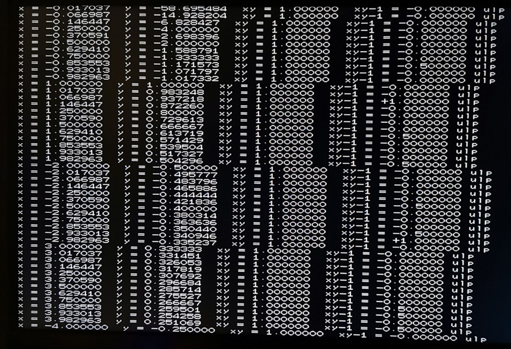

# ReLMのカスタマイズ

ReLMアーキテクチャは、ハードウェア構成や利用目的に応じて以下の手段でカスタマイズが可能になっています。

* I/Oポートへの拡張デバイス接続
* カスタム拡張命令セット

これらのソフトウェア（アプリケーション）への影響を比較すると、前者は比較的小規模なデバイスドライバの開発に留まるのに対し、後者は比較的大規模で、例えば浮動小数点への対応では複雑な命令アーキテクチャ体系の拡張が必要となります。

ハードウェア面では、I/Oポート上のデバイスは全プロセッサで共有されるのに対し、カスタム拡張命令セットの回路は全てのプロセッサで個別に付加されますので、それだけ回路規模や動作周波数に対する条件は厳しくなります。

## カスタム拡張命令用モジュール

ReLMアーキテクチャの論理合成の際、何らかのカスタム拡張命令用回路モジュールをリンクする必要があります。

現在用意済みの拡張命令モジュールは以下になります。

* カスタム拡張命令無し（relm_custom_none.v）
* 整数除算命令対応（relm_custom_div.v）
* 整数除算および浮動小数点演算対応（relm_custom_div_fp.v）

以下はカスタム拡張命令無し（relm_custom_none.v）のモジュールで、回路規模を抑えたい場合や自前で拡張命令を開発する際の雛型として使用します。

~~~ v
module relm_custom(clk, op_in, a_in, cb_in, x_in, xb_in, opb_in, mul_ax_in, mul_a_out, mul_x_out, a_out, cb_out, retry_out);
	parameter WD = 32;
	parameter WOP = 5;
	parameter WC = 0;
	input clk;
	input [WOP-1:0] op_in;
	input [WD-1:0] a_in;
	input [WC+WD-1:0] cb_in;
	input [WD-1:0] x_in;
	input [WD-1:0] xb_in;
	input opb_in;
	input [WD*2-1:0] mul_ax_in;
	output [WD-1:0] mul_a_out;
	assign mul_a_out = {WD{1'bx}};
	output [WD-1:0] mul_x_out;
	assign mul_x_out = {WD{1'bx}};
	output [WD-1:0] a_out;
	assign a_out = {WD{1'bx}};
	output [WC+WD-1:0] cb_out;
	assign cb_out = {WC+WD{1'bx}};
	output retry_out;
	assign retry_out = 0;
endmodule
~~~

以下がパラメータおよび入出力信号になります。

* parameter WD = 32;  
  ワードビット長。
* parameter WOP = 5;  
  命令コードビット長。
* parameter WC = 0;  
  カスタムレジスタ（C）ビット長。使用しない場合は０を指定。
* input clk;  
  クロック信号。基本的に命令実行は１クロック内で完了する組み合わせ回路となるため、通常は使用しない。
* input [WOP-1:0] op_in;  
  命令コード。
* input [WD-1:0] a_in;  
  アキュムレータ（Acc）入力。
* input [WC+WD-1:0] cb_in;  
  カスタムレジスタ（C）とレジスタ（B）の入力。
* input [WD-1:0] x_in;  
  コードメモリ上のオペランド値。OPB命令の場合は命令コード。
* input [WD-1:0] xb_in;  
  演算用オペランド値。OPB命令の場合はレジスタ（B）の値。
* input opb_in;  
  OPB命令フラグ。
* input [WD*2-1:0] mul_ax_in;  
  基本命令用乗算器出力。
* output [WD-1:0] mul_a_out;  
  基本命令用乗算器入力。
* output [WD-1:0] mul_x_out;  
  基本命令用乗算器入力。
* output [WD-1:0] a_out;  
  アキュムレータ（Acc）出力。
* output [WC+WD-1:0] cb_out;  
  カスタムレジスタ（C）とレジスタ（B）の出力。
* output retry_out;
  リトライ出力。１を出力した場合、PUT命令の衝突時と同様に命令を再実行する。

カスタム拡張命令用モジュールは、基本的に演算前のレジスタ値と命令コードを入力して、演算結果のレジスタ値を出力するという構成になっています。

演算処理が複雑になれば演算結果出力に遅延が発生し、動作可能なクロック周波数が低下します。

そのため、整数除算や浮動小数点演算のような複雑な演算処理の場合、１クロック内で実行可能な処理に分割して実行する必要があります。

後述の整数除算や浮動小数点演算に関しては、比較的低性能の旧ターゲットボードDE0-CVで８コア50MHzでの動作が可能となるような命令の粒度で構成されています。

## 整数除算命令拡張

以下は整数除算命令拡張用のモジュール（relm_custom_div.v）になります。

relm_custom_div.v

~~~ v
module relm_lower(d_in, q_out);
	parameter WD = 32;
	input [WD-1:0] d_in;
	output [WD-1:0] q_out;
	wire [WD-1:0] d1 = d_in | (d_in >> 1);
	wire [WD-1:0] d2 = d1 | (d1 >> 2);
	wire [WD-1:0] d4 = d2 | (d2 >> 4);
	wire [WD-1:0] d8 = d4 | (d4 >> 8);
	assign q_out = d8 | (d8 >> 16);
endmodule

module relm_compare(a_in, b_in, gt_out);
	parameter WD = 32;
	input [WD-1:0] a_in, b_in;
	output gt_out;
	wire [WD-1:0] ab, ba;
	relm_lower #(WD) ab_lower(a_in & ~b_in, ab);
	relm_lower #(WD) ba_lower(b_in & ~a_in, ba);
	assign gt_out = |(ab & ~ba);
endmodule

module relm_custom(clk, op_in, a_in, cb_in, x_in, xb_in, opb_in, mul_ax_in, mul_a_out, mul_x_out, a_out, cb_out, retry_out);
	parameter WD = 32;
	parameter WOP = 5;
	parameter WC = 64;
	input clk;
	input [WOP-1:0] op_in;
	input [WD-1:0] a_in;
	input [WC+WD-1:0] cb_in;
	wire [WD-1:0] d_in, c_in, b_in;
	assign {d_in, c_in, b_in} = cb_in;
	input [WD-1:0] x_in;
	input [WD-1:0] xb_in;
	input opb_in;
	input [WD*2-1:0] mul_ax_in;
	output reg [WD-1:0] mul_a_out;
	output reg [WD-1:0] mul_x_out;
	output reg [WD-1:0] a_out;
	output [WC+WD-1:0] cb_out;
	reg [WD-1:0] d_out, c_out, b_out;
	assign cb_out = {d_out, c_out, b_out};
	output retry_out;
	assign retry_out = 0;
	wire [WD-1:0] a_lower;
	wire [WD-1:0] div_n = a_lower ^ (a_lower >> 1);
	relm_lower #(WD) lower_a(a_in, a_lower);
	wire [WD-1:0] xb_lower;
	wire [WD-1:0] div_d = xb_lower ^ (xb_lower >> 1);
	relm_lower #(WD) lower_xb(xb_in, xb_lower);
	wire [WD-1:0] div_n10 = d_in - c_in;
	wire [WD-1:0] div_q10 = a_in;
	wire div_gt10;
	relm_compare #(WD) compare_gt10(c_in, d_in, div_gt10);
	wire [WD-1:0] div_n11 = div_n10 - (c_in >> 1);
	wire [WD-1:0] div_q11 = a_in | (a_in >> 1);
	wire div_gt11;
	relm_compare #(WD) compare_gt11(c_in >> 1, div_n10, div_gt11);
	wire [WD-1:0] div_n01 = d_in - (c_in >> 1);
	wire [WD-1:0] div_q01 = a_in >> 1;
	wire div_gt01;
	relm_compare #(WD) compare_gt01(c_in >> 1, d_in, div_gt01);
	always @*
	begin
		casez ({opb_in, x_in[WOP+1:WOP], op_in[2:0]})
			6'b0??101, 6'b100101: begin // DIV
				mul_a_out <= {WD{1'bx}};
				mul_x_out <= {WD{1'bx}};
				d_out <= a_in; // N
				c_out <= xb_in; // D
				b_out <= div_d; // d
				a_out <= div_n; // n
			end
			6'b101101: begin // OPB DIVINIT
				mul_a_out <= a_in; // q
				mul_x_out <= c_in; // D
				d_out <= d_in; // N
				c_out <= mul_ax_in[WD-1:0]; // Dq
				b_out <= 0; // Q
				a_out <= a_in; // q
			end
			6'b110101: begin // OPB DIVLOOP
				mul_a_out <= {WD{1'bx}};
				mul_x_out <= {WD{1'bx}};
				d_out <= div_gt10 ? ((div_gt01 | a_in[0]) ? d_in : div_n01) : ((div_gt11 | a_in[0]) ? div_n10 : div_n11); // N : N - Dq/2 : N - Dq : N - Dq - Dq/2
				c_out <= a_in[1:0] ? 32'd0 : c_in >> 2; // 0 : Dq >> 2
				b_out <= b_in | (div_gt10 ? (div_gt01 ? 32'd0 : div_q01) : (div_gt11 ? div_q10 : div_q11)); // Q : Q + q/2 : Q + q : Q + q + q/2
				a_out <= a_in >> 2; // q >> 2
			end
			6'b111101: begin // OPB DIVMOD
				mul_a_out <= {WD{1'bx}};
				mul_x_out <= {WD{1'bx}};
				d_out <= d_in; // N
				c_out <= c_in; // Dq
				b_out <= b_in; // Q
				a_out <= d_in; // N
			end
			default: begin
				mul_a_out <= {WD{1'bx}};
				mul_x_out <= {WD{1'bx}};
				d_out <= {WD{1'bx}};;
				c_out <= {WD{1'bx}};;
				b_out <= {WD{1'bx}};;
				a_out <= {WD{1'bx}};;
			end
		endcase
	end
endmodule
~~~

 

このモジュールではcustom5の系列に(OPB) DIVおよび、OPB専用の拡張命令としてDIVINIT, DIVLOOP, DIVMODを付加しています。

custom5は通常の乗算命令MULと命令コードの下位ビットが一致するため、乗算器を共用する際の命令デコードが効率的になるという理由で選択されています。

| OpCode | +0 | +1 | +2 | +3 | +4 | +5 | +6 | +7 |
| --- | --- | --- | --- | --- | --- | --- | --- | --- |
| 0x00 | LOAD | SWAP/SHIFT | BLOAD | BSLOAD | ADD | AND | XOR | OR |
| 0x08 | PUSH/OUT | POP/IO | PUT | PUTS | RSUB | JEQ | JNE | JUMP |
| 0x10 | UGT | ULT | IGT | ILT | SUB | MUL | SHR | SAR |
| 0x18 | custom0 | custom1 | custom2 | custom3 | custom4 | **DIV** | custom6 | OPB/HALT |
| 0x20 | | | BLOADX | BSLOADX | | | | |
| 0x38 | | | | | | **DIVINIT** | | |
| 0x58 | | | | | | **DIVLOOP** | | |
| 0x78 | | | | | | **DIVMOD** | | |

整数除算アルゴリズムは内部的に２ワード分のカスタムレジスタを使用しますので、これらをC, Dレジスタとして除算アルゴリズム実行時のデータの流れを以下に示します。

| OpCode | D | C | B | A | X (operand) or Remarks |
| --- | --- | --- | --- | --- | --- |
| DIV | | | | **N (numerator)** | **D (denominator)** |
| OPB SHR | N | D | d (MSB of D) | n (MSB of N) | SHR (opcode) |
| OPB DIVINIT | N | D | d | q := n / d | DIVINIT (opcode) |
| OPB DIVLOOP | R' := N | Dq := D * q | Q' := 0 | q | DIVLOOP (opcode) |
| OPB DIVLOOP | R'' | Dq >>= 2 | Q'' | q >>= 2 | DIVLOOP (opcode) |
| OPB DIVLOOP | R''' | Dq >>= 2 | Q''' | q >>= 2 | DIVLOOP (opcode) |
| OPB DIVLOOP | | | . . . | | DIVLOOP (opcode) |
| JNE | R (remainder) | | Q (quotient) | finished when q == 0 | # repeat DIVLOOP |
| OPB LOAD | R (remainder) | | Q (quotient) | | LOAD (opcode) |
| | | | | **Q (quotient)** | # to get the result for Q |
| OPB DIVMOD | R (remainder) | | Q (quotient) | | DIVMOD (opcode) |
| | | | | **R (remainder)** | # to get the result for R |

最初のDIV命令からDIVINIT命令までの処理は除数と被除数をパラメータとして受け取った後、後段のDIVLOOPによる処理のために内部状態の初期化を行います。

DIVLOOPでは古典的な除算アルゴリズムと同様に上位ビットから商を決定していきますが、relm_compareモジュールで引き算よりも先に大小比較結果を先読みする方法で２ビット分を一度に処理する構成になっています。

DIVLOOPをアキュムレータ（Acc）が０になるまで繰り返し実行すると、レジスタ（B）に商、カスタムレジスタ（D）に剰余が格納されます。

カスタムレジスタ（D）の剰余を取り出す場合、DIVMODを使用します。

## 整数除算命令拡張の利用

基本命令のコンパイラ（relm.py）で切り捨て除算（//）および剰余（%）を式中で使用した場合、ハードウェア実装の有無に関わらず拡張命令（DIV, DIVINIT, DIVLOOP, DIVMOD）を使用したコードを出力します。

ただし、現状の整数除算は除数、被除数ともに符号なし32ビット整数として扱う処理となっていますので、負数をそのまま入力すると異常な結果となります。

もし負数を扱いたい場合は、まず正数に直してから除算を行い、後で符号を反映する処理を追加してください。

Playable PoCのバブルエステートは資産状況を表す棒グラフ表示のスケーリングに除算を使用していますので、そのまま除算命令のテストコードにもなっています。

## 浮動小数点演算命令拡張

浮動小数点演算は、[IEEE 754](https://ja.wikipedia.org/wiki/IEEE_754)の[単精度浮動小数点形式（binary32）](https://ja.wikipedia.org/wiki/%E5%8D%98%E7%B2%BE%E5%BA%A6%E6%B5%AE%E5%8B%95%E5%B0%8F%E6%95%B0%E7%82%B9%E6%95%B0)がちょうど１ワード長となるため、通常の整数と同様にレジスタ内に格納し、レジスタ操作を兼用します。

これにより、符号等に関する単純なビット操作を直接行うことが可能になりますが、レジスタの値が整数と浮動小数点のどちらかを区別できないため、ソフトウェア側で適切な管理が必要となります。

浮動小数点演算に関しては、以下の表に示す通り、比較的多くの命令を拡張しています。

| OpCode | +0 | +1 | +2 | +3 | +4 | +5 | +6 | +7 |
| --- | --- | --- | --- | --- | --- | --- | --- | --- |
| 0x00 | LOAD | SWAP/SHIFT | BLOAD | BSLOAD | ADD | AND | XOR | OR |
| 0x08 | PUSH/OUT | POP/IO | PUT | PUTS/**PUTM** | RSUB | JEQ | JNE | JUMP |
| 0x10 | UGT | ULT | IGT | ILT | SUB | MUL | SHR | SAR |
| 0x18 | **ITOF** | **FMUL** | **FADD** | **ROUND/TRUNC** | **FCOMP** | DIV | **FDIV** | OPB/HALT |
| 0x20 | | | BLOADX | BSLOADX | | | | |
| 0x38 | **ISIGN** | **FSQU** | | **FTOI** | | DIVINIT | | |
| 0x58 | | | | | | DIVLOOP | | |
| 0x78 | | | | | | DIVMOD | | |

命令の構成を以下に示しますが、処理の効率上、[非正規化数](https://ja.wikipedia.org/wiki/%E9%9D%9E%E6%AD%A3%E8%A6%8F%E5%8C%96%E6%95%B0)は０として扱います。

これにより、例えば乗算（FMUL）では後処理での正規化が不要となるため、命令数を削減して効率の向上を図ることが可能となります。

* ITOF, ISIGN  
  整数を浮動小数点に変換する。  
  アキュムレータ（Acc）で仮数部、オペランド（XB）で符号および指数部を指定する。  
  乗算や加算の後処理の正規化にも利用される。  
  目立たない機能としては、浮動小数点除算の後処理用にカスタムレジスタ（C）の値をレジスタ（B）にコピーする。  
  ISIGNは符号付き整数を浮動小数点に変換する場合の前処理。
* FMUL, FSQU  
  FMULは乗算、FSQUは平方を計算。  
  ITOFを後処理として利用し、**FMUL, ITOF** の２命令で浮動小数点の乗算を実行。  
  後処理へのデータ受け渡しにレジスタ（B）を使用。
* FADD  
  後処理も含めて **FADD, ITOF** の２命令で浮動小数点の加算を実行。  
  後処理へのデータ受け渡しにレジスタ（B）を使用。
* PUTM  
  引き算の専用命令は特に無いため、符号反転した上で加算を実行する。  
  **XOR 0x80000000** の１命令で浮動小数点の符号反転は可能だが、なるべく命令数を減らすため、PUTと同時に符号反転を実施する命令 **PUTM** が用意されている。  
  実際はPUTMはPUTSと同じ命令コードが割り当てられており、オペランド（X）の書き込み先アドレスの最上位ビットで区別している。（最上位ビットが０でPUTM）  
  PUTSをOPB形式で使用することはまず無いと考えられるため、OPB形式の場合、書き込み先アドレスの最上位ビットに関わらず常にPUTMとする。  
  PUTM自体は回路規模としては小さいため、実際には基本命令セットの回路にPUTMの機能が組み込まれている。
* ROUND/TRUNC  
  加算と合わせて様々なモードの整数への丸め（round, floor, ceil, trunc）を実現。  
  例えば **ROUND 1.0, OPB TRUNC, OPB FADD, OPB ITOF** の４命令で天井（ceil）が実現できる。  
  同様に床（floor）は **ROUND 1.0, OPB TRUNC, OPB FADD, OPB ITOF**、最近整数への丸め（round）は **ROUND 0.5, OPB FADD, OPB ITOF, OPB TRUNC** で可能。  
  単に **OPB TRUNC** とすると、０方向への丸め（trunc）となる。
* FTOI  
  浮動小数点を整数に変換。  
  入力範囲は $(1-2^{24})\sim (2^{24}-1)$ のみ対応。
* FCOMP  
  浮動小数点の大小を比較。  
  Acc > XB の場合 **1**、Acc == XB の場合 **0**、Acc < XB の場合 **-1** をアキュムレータ（Acc）に格納。  
  非数（NaN）は正の無限大 $(+\infty)$ より大きいか負の無限大 $(-\infty)$ より小さい。  
  正負のゼロ $(\pm 0)$ および非正規化数は互いに等しい。
* FDIV  
  浮動小数点除算の前処理として指数部と仮数部の分離を実行。  
  指数部のみによる除算結果をカスタムレジスタ（C）に格納する。  
  仮数部の逆数計算末尾のITOF命令でカスタムレジスタ（C）からレジスタ（B）に指数部の除算結果がコピーされるので、仮数部の逆数と掛け合わせて浮動小数点除算が完了する。  
  仮数部の逆数計算については後述。

演算回路の実装コードは以下になりますが、個々の命令の実装は比較的コンパクトです。

relm_custom_div_fp.v

~~~ v
module relm_lower(d_in, q_out);
	parameter WD = 32;
	input [WD-1:0] d_in;
	output [WD-1:0] q_out;
	wire [WD-1:0] d1 = d_in | (d_in >> 1);
	wire [WD-1:0] d2 = d1 | (d1 >> 2);
	wire [WD-1:0] d4 = d2 | (d2 >> 4);
	wire [WD-1:0] d8 = d4 | (d4 >> 8);
	assign q_out = d8 | (d8 >> 16);
endmodule

module relm_compare(a_in, b_in, gt_out);
	parameter WD = 32;
	input [WD-1:0] a_in, b_in;
	output gt_out;
	wire [WD-1:0] ab, ba;
	relm_lower #(WD) ab_lower(a_in & ~b_in, ab);
	relm_lower #(WD) ba_lower(b_in & ~a_in, ba);
	assign gt_out = |(ab & ~ba);
endmodule

module relm_custom(clk, op_in, a_in, cb_in, x_in, xb_in, opb_in, mul_ax_in, mul_a_out, mul_x_out, a_out, cb_out, retry_out);
	parameter WD = 32;
	parameter WOP = 5;
	parameter WC = 64;
	input clk;
	input [WOP-1:0] op_in;
	input [WD-1:0] a_in;
	input [WC+WD-1:0] cb_in;
	wire [WD-1:0] d_in, c_in, b_in;
	assign {d_in, c_in, b_in} = cb_in;
	input [WD-1:0] x_in;
	input [WD-1:0] xb_in;
	input opb_in;
	input [WD*2-1:0] mul_ax_in;
	output reg [WD-1:0] mul_a_out;
	output reg [WD-1:0] mul_x_out;
	output reg [WD-1:0] a_out;
	output [WC+WD-1:0] cb_out;
	reg [WD-1:0] d_out, c_out, b_out;
	assign cb_out = {d_out, c_out, b_out};
	output retry_out;
	assign retry_out = 0;
	wire [WD-1:0] a_lower;
	wire [WD-1:0] div_n = a_lower ^ (a_lower >> 1);
	relm_lower #(WD) lower_a(a_in, a_lower);
	wire [WD-1:0] xb_lower;
	wire [WD-1:0] div_d = xb_lower ^ (xb_lower >> 1);
	relm_lower #(WD) lower_xb(xb_in, xb_lower);
	wire [WD-1:0] div_n10 = d_in - c_in;
	wire [WD-1:0] div_q10 = a_in;
	wire div_gt10;
	relm_compare #(WD) compare_gt10(c_in, d_in, div_gt10);
	wire [WD-1:0] div_n11 = div_n10 - (c_in >> 1);
	wire [WD-1:0] div_q11 = a_in | (a_in >> 1);
	wire div_gt11;
	relm_compare #(WD) compare_gt11(c_in >> 1, div_n10, div_gt11);
	wire [WD-1:0] div_n01 = d_in - (c_in >> 1);
	wire [WD-1:0] div_q01 = a_in >> 1;
	wire div_gt01;
	relm_compare #(WD) compare_gt01(c_in >> 1, d_in, div_gt01);
	
	wire [7:0] a_exp = a_in[WD-2:WD-9];
	wire a_zero = !a_exp;
	wire a_inf = &a_exp;
	wire a_nan = a_inf & |a_in[WD-10:0];
	wire [7:0] xb_exp = xb_in[WD-2:WD-9];
	wire xb_zero = !xb_exp;
	wire xb_inf = &xb_exp;
	wire xb_nan = xb_inf & |xb_in[WD-10:0];

	reg [30:0] itof_mul;
	wire [4:0] itof_dif;
	assign itof_dif[4] = !a_lower[15];
	wire [15:0] itof_dif4 = itof_dif[4] ? {a_lower[14:1], 2'b11} : a_lower[30:15];
	assign itof_dif[3] = !itof_dif4[8];
	wire [7:0] itof_dif3 = itof_dif[3] ? itof_dif4[7:0] : itof_dif4[15:8];
	assign itof_dif[2] = !itof_dif3[4];
	wire [3:0] itof_dif2 = itof_dif[2] ? itof_dif3[3:0] : itof_dif3[7:4];
	assign itof_dif[1] = !itof_dif2[2];
	assign itof_dif[0] = itof_dif[1] ? !itof_dif2[1] : !itof_dif2[3];
	wire [62:0] itof_mul_ax = itof_mul * ((x_in[WOP] & a_in[WD-1]) ? -a_in : a_in);

	wire itofx_s = |a_in[5:0];
	wire itofx_u1 = a_in[7] & |{a_in[8], a_in[6], itofx_s};
	wire itofx_u0 = a_in[6] & |{a_in[7], itofx_s};
	wire [7:0] itofx_e = b_in[WD-2:WD-9];
	wire [4:0] itofx_dif = b_in[4:0];
	wire itofx_c = a_in[31] | &a_in[30:6];
	wire [1:0] itofx_inf_gt = {1'b0, itofx_e[0]} + {1'b0, ~itofx_dif[0]} + {1'b0, itofx_c};
	wire itofx_inf = b_in[WD-10] | (&itofx_e[7:1] & !itofx_dif[4:1] & itofx_inf_gt[1]);
	wire [7:0] itofx_difc = {3'd0, itofx_dif} + {7'd0, ~itofx_c};
	wire itofx_zero_gt;
	relm_compare #(8) compare_itofx_zero(itofx_difc, itofx_e, itofx_zero_gt);
	wire itofx_zero = itofx_zero_gt | b_in[WD-11];

	wire [9:0] fmul_e = {2'b00, a_exp} + {2'b00, xb_exp} - 10'h7F;
	wire fmul_zero = fmul_e[9] | a_zero | xb_zero | a_nan | xb_nan;
	wire fmul_inf = (fmul_e[9:8] == 2'b01) | a_inf | xb_inf;
	wire [9:0] fsqu_e = {1'b0, a_exp, 1'b0} - 10'h7F;
	wire fsqu_zero = fsqu_e[9] | a_zero | a_nan;
	wire fsqu_inf = (fsqu_e[9:8] == 2'b01) | a_inf;
	wire [47:0] fmul_ax = {1'd1, a_in[22:0]} * {1'd1, (opb_in && x_in[WOP]) ? a_in[22:0] : xb_in[22:0]};

	wire [9:0] fdiv_e = {2'b00, xb_exp} - {2'b00, a_exp} + 10'h7F;
	wire fdiv_zero = fdiv_e[9] | xb_zero | a_inf;
	wire fdiv_inf = (fdiv_e[9:8] == 2'b01) | xb_inf | a_zero;
	wire fdiv_nan = (xb_zero & a_zero) | (xb_inf & a_inf) | xb_nan | a_nan;

	wire fadd_gt;
	relm_compare #(WD-1) compare_fadd(a_in[30:0], xb_in[30:0], fadd_gt);
	wire [31:0] fadd_max = fadd_gt ? a_in : xb_in;
	wire fadd_inf = fadd_gt ? a_inf : xb_inf;
	wire fadd_zero = fadd_gt ? a_zero | a_nan : xb_zero | xb_nan;
	wire [7:0] fadd_d = fadd_gt ? a_exp - xb_exp : xb_exp - a_exp;
	wire [4:0] fadd_dif = fadd_d[7:5] ? 5'd31 : fadd_d[4:0];
	wire [23:0] fadd_m = (a_zero | xb_zero) ? 24'd0 : {1'b1, fadd_gt ? xb_in[22:0] : a_in[22:0]};

	wire [24:0] faddx_m0 = cb_in[5] ? {1'd0, a_in[23:0]} : {a_in[23:0], 1'd0};
	wire [26:0] faddx_m1 = cb_in[6] ? {2'd0, faddx_m0} : {faddx_m0, 2'd0};
	wire [30:0] faddx_m2 = cb_in[7] ? {4'd0, faddx_m1} : {faddx_m1, 4'd0};
	wire [30:0] faddx_m3 = cb_in[8] ? {8'd0, faddx_m2[30:9], |faddx_m2[8:0]} : faddx_m2;
	wire [31:0] faddx_mr = {1'b0, b_in[9] ? {16'd0, faddx_m3[30:17], |faddx_m3[16:0]} : faddx_m3};
	wire [31:0] faddx_ml = {2'b01, c_in[22:0], 7'd0};
	wire [31:0] faddx_m = a_in[31] ? faddx_ml - faddx_mr : faddx_ml + faddx_mr;

	wire [22:0] trunc_m = (a_in[23] ? 23'h2AAAAA : 23'h555555) & (a_in[24] ? 23'h199999 : 23'h666666) & (a_in[25] ? 23'h078787 : 23'h787878) & (a_in[26] ? 23'h007F80 : 23'h7F807F) & (a_in[27] ? 23'h00007F : 23'h7FFF80);
	wire [21:0] trunc_ml;
	relm_lower #(22) lower_trunc(trunc_m[22:1], trunc_ml);
	wire [30:0] trunc_fmask = a_in[30] ? {9'd0, !a_in[29:28] ? trunc_ml : 22'd0} : {&a_in[29:23] ? 8'h00 : 8'hFF, 23'h7FFFFF};
	wire trunc_fract = |(a_in[30:0] & trunc_fmask);

	wire [31:0] ftoi_m = {9'b1, a_in[22:0]};
	wire [31:0] ftoi_s = a_in[30] ? {9'd0, trunc_m} : &a_in[29:23] ? 32'h00800000 : 32'h01000000;

	wire [31:0] fcomp_a = !a_in[WD-2:WD-9] ? 32'h80000000 : {~a_in[WD-1], a_in[WD-1] ? ~a_in[WD-2:0] : a_in[WD-2:0]};
	wire [31:0] fcomp_xb = !xb_in[WD-2:WD-9] ? 32'h80000000 : {~xb_in[WD-1], xb_in[WD-1] ? ~xb_in[WD-2:0] : xb_in[WD-2:0]};
	wire fcomp_gt;
	relm_compare #(WD) compare_fcomp(fcomp_a, fcomp_xb, fcomp_gt);

	integer i;
	always @*
	begin
		itof_mul[0] <= a_lower[30];
		for (i = 1; i < 31; i = i + 1) itof_mul[i] <= div_n[30-i];
		casez ({opb_in, x_in[WOP+1:WOP], op_in[2:0]})
			6'b0??000, 6'b1?0000: begin // (OPB) ITOF
				mul_a_out <= {WD{1'bx}};
				mul_x_out <= {WD{1'bx}};
				d_out <= d_in;
				c_out <= c_in;
				b_out <= {x_in[WOP] ? a_in[WD-1] : xb_in[WD-1], xb_in[WD-2:WD-10], xb_in[WD-11] | !a_lower[0], {WD-16{1'bx}}, xb_in[4:0] + itof_dif};
				a_out <= itof_mul_ax[31:0];
			end
			6'b1?1000: begin // OPB ITOFX
				mul_a_out <= {WD{1'bx}};
				mul_x_out <= {WD{1'bx}};
				d_out <= d_in;
				c_out <= c_in;
				b_out <= d_in;
				a_out[WD-1] <= b_in[WD-1];
				a_out[WD-2:WD-9] <= itofx_inf ? 8'hFF : itofx_zero ? 8'h00 : itofx_e - itofx_difc + 8'd1;
				a_out[WD-10:0] <= (itofx_inf | itofx_zero) ? {&b_in[WD-10:WD-11], 22'd0} : (a_in[31] ? a_in[30:8] + {22'd0, itofx_u1} : a_in[29:7] + {22'd0, itofx_u0});
			end
			6'b0??001, 6'b1?0001: begin // (OPB) FMUL
				mul_a_out <= {WD{1'bx}};
				mul_x_out <= {WD{1'bx}};
				d_out <= d_in;
				c_out <= c_in;
				b_out <= {a_in[WD-1] ^ xb_in[WD-1], fmul_e[9:8] ? 8'h7F : fmul_e[7:0], fmul_inf, fmul_zero, {WD-16{1'bx}}, 5'd0};
				a_out <= {fmul_ax[47:17], |fmul_ax[16:0]};
			end
			6'b1?1001: begin // OPB FSQU
				mul_a_out <= {WD{1'bx}};
				mul_x_out <= {WD{1'bx}};
				d_out <= d_in;
				c_out <= c_in;
				b_out <= {1'b0, fsqu_e[9:8] ? 8'h7F : fsqu_e[7:0], fsqu_inf, fsqu_zero, {WD-16{1'bx}}, 5'd0};
				a_out <= {fmul_ax[47:17], |fmul_ax[16:0]};
			end
			6'b0??010, 6'b1?0010: begin // (OPB) FADD
				mul_a_out <= {WD{1'bx}};
				mul_x_out <= {WD{1'bx}};
				d_out <= d_in;
				c_out <= {c_in[WD-1:23], fadd_max[22:0]};
				b_out <= {fadd_max[31:23], fadd_inf, fadd_zero, {WD-21{1'bx}}, fadd_dif, 5'd0};
				a_out <= {a_in[WD-1] ^ xb_in[WD-1], 7'bxxxxxxx, fadd_m};
			end
			6'b1?1010: begin // OPB FADDX
				mul_a_out <= {WD{1'bx}};
				mul_x_out <= {WD{1'bx}};
				d_out <= d_in;
				c_out <= c_in;
				b_out <= b_in;
				a_out <= faddx_m;
			end
			6'b0??011: begin // ROUND
				mul_a_out <= {WD{1'bx}};
				mul_x_out <= {WD{1'bx}};
				d_out <= d_in;
				c_out <= c_in;
				b_out <= {a_in[WD-1], (!x_in[WD-9] || (a_in[WD-1] == x_in[WD-1] && trunc_fract)) ? x_in[WD-2:WD-9] : 8'h00, 23'd0};
				a_out <= a_in;
			end
			6'b1?0011: begin // OPB TRUNC
				mul_a_out <= {WD{1'bx}};
				mul_x_out <= {WD{1'bx}};
				d_out <= d_in;
				c_out <= c_in;
				b_out <= b_in;
				a_out <= {a_in[WD-1], a_in[30:0] & ~trunc_fmask};
			end
			6'b1?1011: begin // OPB FTOI
				mul_a_out <= {WD{1'bx}};
				mul_x_out <= {WD{1'bx}};
				d_out <= d_in;
				c_out <= c_in;
				b_out <= ftoi_s;
				a_out <= a_in[WD-1] ? -ftoi_m : ftoi_m;
			end
			6'b???100: begin // (OPB) FCOMP
				mul_a_out <= {WD{1'bx}};
				mul_x_out <= {WD{1'bx}};
				d_out <= d_in;
				c_out <= c_in;
				b_out <= b_in;
				a_out <= fcomp_gt ? 32'd1 : (fcomp_a == fcomp_xb) ? 32'd0 : 32'hFFFFFFFF;
			end
			6'b0??101, 6'b100101: begin // DIV
				mul_a_out <= {WD{1'bx}};
				mul_x_out <= {WD{1'bx}};
				d_out <= a_in; // N
				c_out <= xb_in; // D
				b_out <= div_d; // d
				a_out <= div_n; // n
			end
			6'b101101: begin // OPB DIVINIT
				mul_a_out <= a_in; // q
				mul_x_out <= c_in; // D
				d_out <= d_in; // N
				c_out <= mul_ax_in[WD-1:0]; // Dq
				b_out <= 0; // Q
				a_out <= a_in; // q
			end
			6'b110101: begin // OPB DIVLOOP
				mul_a_out <= {WD{1'bx}};
				mul_x_out <= {WD{1'bx}};
				d_out <= div_gt10 ? ((div_gt01 | a_in[0]) ? d_in : div_n01) : ((div_gt11 | a_in[0]) ? div_n10 : div_n11); // N : N - Dq/2 : N - Dq : N - Dq - Dq/2
				c_out <= a_in[1:0] ? 32'd0 : c_in >> 2; // 0 : Dq >> 2
				b_out <= b_in | (div_gt10 ? (div_gt01 ? 32'd0 : div_q01) : (div_gt11 ? div_q10 : div_q11)); // Q : Q + q/2 : Q + q : Q + q + q/2
				a_out <= a_in >> 2; // q >> 2
			end
			6'b111101: begin // OPB DIVMOD
				mul_a_out <= {WD{1'bx}};
				mul_x_out <= {WD{1'bx}};
				d_out <= d_in; // N
				c_out <= c_in; // Dq
				b_out <= b_in; // Q
				a_out <= d_in; // N
			end
			6'b???110: begin // (OPB) FDIV
				mul_a_out <= {WD{1'bx}};
				mul_x_out <= {WD{1'bx}};
				d_out <= {a_in[WD-1] ^ xb_in[WD-1], fdiv_inf ? 8'hFF : fdiv_zero ? 8'h00 : fdiv_e[7:0], (fdiv_inf || fdiv_zero) ? {fdiv_nan, 21'd0} : xb_in[22:0]};
				c_out <= c_in;
				b_out <= b_in;
				a_out <= {9'h7F, a_in[22:0]};
			end
			default: begin
				mul_a_out <= {WD{1'bx}};
				mul_x_out <= {WD{1'bx}};
				d_out <= {WD{1'bx}};;
				c_out <= {WD{1'bx}};;
				b_out <= {WD{1'bx}};;
				a_out <= {WD{1'bx}};;
			end
		endcase
	end
endmodule
~~~

 

## 浮動小数点除算

FDIV命令は、オペランド（XB）の被除数をアキュムレータ（Acc）の除数で除算を実行するための前処理を行います。

除数を指数部と仮数部に分解して、指数部のみによる除算結果をカスタムレジスタ（C）に格納します。

アキュムレータ（Acc）には $1.0\sim 2.0$ に正規化された仮数部が残りますので、この逆数を計算して先程の指数部の除算結果と掛けた上で最終的な除算結果を求める必要があります。

この仮数部の逆数計算は[Newton-Raphson除算](https://en.wikipedia.org/wiki/Division_algorithm#Variant_Newton%E2%80%93Raphson_division)をベースにした手法を使いますが、単精度浮動小数点に対応して少し改変した方法を用います。

上記のリンク先の方法では３次の[チェビシェフ多項式](https://ja.wikipedia.org/wiki/%E3%83%81%E3%82%A7%E3%83%93%E3%82%B7%E3%82%A7%E3%83%95%E5%A4%9A%E9%A0%85%E5%BC%8F)で近似値を求めてから３次収束の反復式を使って精度を上げていきますが、必要な反復回数の見積もりが $$\log_3\left(\frac{24+1}{\log_2 99}\right)=1.208222482$$ となり、反復回数が１回では僅かに精度が不足することになります。

そこで、最初の近似値を４次のチェビシェフ多項式で求めるようにすると、必要な反復回数は $$\log_3\left(\frac{24+1}{\log_2 577}\right)=0.91267307$$ となり、今度は１回だけでも十分なことがわかります。

この方法をもとに仮数部 $1\le D<2$ の逆数 $D^{-1}$ を求める式を書き下すと、以下のようになります。

$$x=\frac{128}{577}\left(3-D\right)\left(\left(D-\frac{3}{2}\right)^2+2\right)$$

$$e=1-xD$$

$$D^{-1}\sim e^2x+ex+x$$

実際の計算精度をテストプログラム relm_test_fp_div.py で確認した結果が、以下の画面出力になります。

$x$ は12次[チェビシェフ多項式の極値点](https://ja.wikipedia.org/wiki/%E3%83%81%E3%82%A7%E3%83%93%E3%82%B7%E3%82%A7%E3%83%95%E5%A4%9A%E9%A0%85%E5%BC%8F#%E9%9B%B6%E7%82%B9%E3%81%A8%E6%A5%B5%E5%80%A4)を1.0～2.0にスケーリングして-1～+2の整数値で振ったもので、理論的に誤差が最大となる４次チェビシェフ多項式の極値点を含みます。

$y$ は $x$ の逆数の計算結果、 $xy$ は逆数の検算で理想的にはちょうど１となります。

誤差を評価するため $xy-1$ を $ulp=2^{-23}$ 単位で表示したものが右端になりますが、一部の点で $-0.5ulp$ か $+1.0ulp$ の誤差がある以外は誤差がほぼ０となっています。（負方向の誤差は指数が変わるので $0.5ulp$ 単位）
