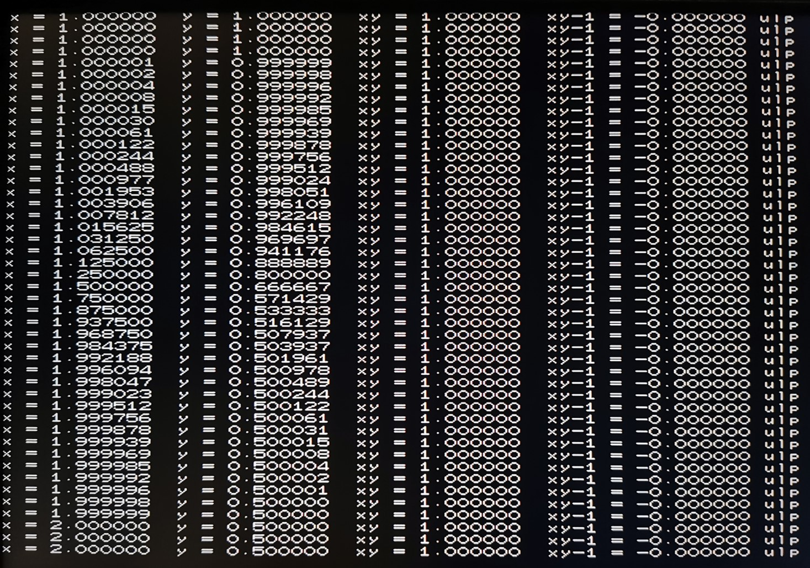
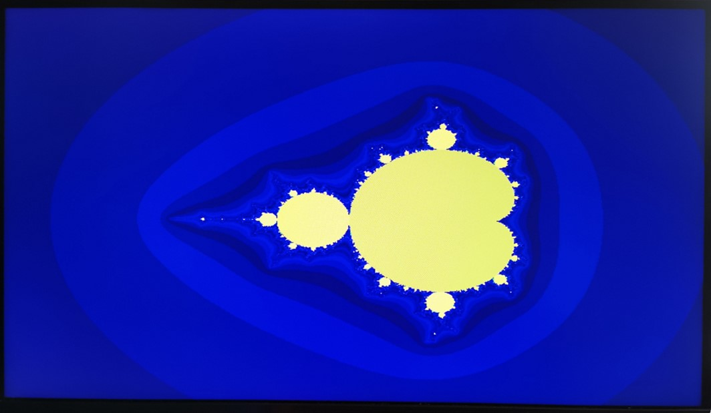

# ReLMのカスタマイズ

ReLMアーキテクチャは、ハードウェア構成や利用目的に応じて以下の手段でカスタマイズが可能になっています。

* I/Oポートへの拡張デバイス接続
* カスタム拡張命令セット

これらのソフトウェア（アプリケーション）への影響を比較すると、前者は比較的小規模なデバイスドライバの開発に留まるのに対し、後者は比較的大規模で、例えば浮動小数点への対応では複雑な命令アーキテクチャ体系の拡張が必要となります。

ハードウェア面では、I/Oポート上のデバイスは全プロセッサで共有されるのに対し、カスタム拡張命令セットの回路は全てのプロセッサで個別に付加されますので、それだけ回路規模や動作周波数に対する条件は厳しくなります。

## カスタム拡張命令用モジュール

ReLMアーキテクチャの論理合成の際、何らかのカスタム拡張命令用回路モジュールをリンクする必要があります。

現在用意済みの拡張命令モジュールは以下になります。

* カスタム拡張命令無し（relm_custom_none.v）
* 整数除算拡張（relm_custom_div.v）
* 浮動小数点演算および整数除算拡張（relm_custom_div_fp.v）

以下はカスタム拡張命令無し（relm_custom_none.v）のモジュールで、回路規模を抑えたい場合や自前で拡張命令を開発する際の雛型として使用します。

[relm_custom_none.v](../relm_custom_none.v)

~~~ v
`define WC 0

module relm_custom(op_in, a_in, cb_in, x_in, xb_in, opb_in, a_out, cb_out);
	parameter WD = 32;
	parameter WOP = 5;
	parameter WC = `WC;
	input [WOP-1:0] op_in;
	input [WD-1:0] a_in;
	input [WC+WD-1:0] cb_in;
	input [WD-1:0] x_in;
	input [WD-1:0] xb_in;
	input opb_in;
	output [WD-1:0] a_out;
	assign a_out = {WD{1'bx}};
	output [WC+WD-1:0] cb_out;
	assign cb_out = {WC+WD{1'bx}};
endmodule
~~~

以下がパラメータおよび入出力信号になります。

* parameter WD = 32;  
  ワードビット長。
* parameter WOP = 5;  
  命令コードビット長。
* parameter WC = 0;  
  カスタムレジスタ（C）ビット長。使用しない場合は０を指定。
* input [WOP-1:0] op_in;  
  命令コード。
* input [WD-1:0] a_in;  
  アキュムレータ（Acc）入力。
* input [WC+WD-1:0] cb_in;  
  カスタムレジスタ（C）とレジスタ（B）の入力。
* input [WD-1:0] x_in;  
  コードメモリ上のオペランド値。OPB命令の場合は命令コード。
* input [WD-1:0] xb_in;  
  演算用オペランド値。OPB命令の場合はレジスタ（B）の値。
* input opb_in;  
  OPB命令フラグ。
* output [WD-1:0] a_out;  
  アキュムレータ（Acc）出力。
* output [WC+WD-1:0] cb_out;  
  カスタムレジスタ（C）とレジスタ（B）の出力。

カスタム拡張命令用モジュールは、基本的に演算前のレジスタ値と命令コードを入力して、演算結果のレジスタ値を出力するという構成になっています。

演算処理が複雑になれば演算結果出力に遅延が発生し、動作可能なクロック周波数が低下します。

そのため、整数除算や浮動小数点演算のような複雑な演算処理の場合、１クロック内で実行可能な処理に分割して実行する必要があります。

後述の整数除算や浮動小数点演算に関しては、比較的低性能の旧ターゲットボードDE0-CVで８コア50MHzでの動作が可能となるような命令の粒度で構成されています。

## 整数除算命令拡張

以下は整数除算命令拡張用のモジュール（relm_custom_div.v）になります。

[relm_custom_div.v](../relm_custom_div.v)

このモジュールではcustom3の系列に(OPB) DIVおよび、OPB専用の拡張命令としてDIVLOOPを付加しています。

| OpCode | +0 | +1 | +2 | +3 | +4 | +5 | +6 | +7 |
| --- | --- | --- | --- | --- | --- | --- | --- | --- |
| 0x00 | LOAD | SWAP/SHIFT | BLOAD | BSLOAD | ADD | AND | XOR | OR |
| 0x08 | PUSH/OUT | POP/IO | PUT | PUTS | RSUB | JEQ | JNE | JUMP |
| 0x10 | UGT | ULT | IGT | ILT | SUB | MUL | SHR | SAR |
| 0x18 | custom0 | custom1 | custom2 | **DIV** | custom4 | custom5 | custom6 | OPB/HALT |
| 0x20 | | | BLOADX | BSLOADX | | | | |
| 0x38 | | | | **DIVLOOP** | | | | |

整数除算アルゴリズムは内部的に１ワード分のカスタムレジスタ（C）を使用します。

除算アルゴリズム実行時のデータの流れを以下に示します。

| OpCode | C | B | A | X (operand) or #Remarks |
| --- | --- | --- | --- | --- |
| DIV | | | **N (numerator)** | **D (denominator)** |
| OPB DIVLOOP | D | r0 | N<<2 + q0 | DIVLOOP (opcode) |
| OPB DIVLOOP | D | r0<<2 + r1 | N<<4 + q0<<2 + q1 | DIVLOOP (opcode) |
| OPB DIVLOOP | | . . . | | DIVLOOP (opcode) |
| | | **R (remainder)** | **Q (quotient)** | # After DIVLOOP x 15 times |

最初のDIV命令からDIVLOOP命令までの処理は除数と被除数をパラメータとして受け取った後、後段のDIVLOOPによる処理のためにレジスタの初期化を行います。

DIVLOOPでは古典的な除算アルゴリズムと同様に上位ビットから商を決定していきますが、１命令あたり２ビット分を処理する構成になっています。

DIV命令では予め２ビット分の処理を行い、後のDIVLOOPが15回分で30ビット処理できますので、計16命令で合わせて32ビットの商を計算して整数除算の処理が完了します。

剰余の場合は **OPB LOAD** でもう１命令掛かりますので、50MHzクロックで320nsで整数除算、340nsで剰余の計算が可能になります。

## 整数除算命令拡張の利用

基本命令のコンパイラ（relm.py）で切り捨て除算（//）および剰余（%）を式中で使用した場合、ハードウェア実装の有無に関わらず拡張命令（DIV, DIVLOOP）を使用したコードを出力します。

ただし、現状の整数除算は除数、被除数ともに符号なし32ビット整数として扱う処理となっていますので、負数をそのまま入力すると異常な結果となります。

もし負数を扱いたい場合は、まず正数に直してから除算を行い、後で符号を反映する処理を追加してください。

Playable PoCのバブルエステートは資産状況を表す棒グラフ表示のスケーリングに除算を使用していますので、そのまま除算命令のテストコードにもなっています。

この他に、[relm_test_int_div.py](../de0cv/loader/relm_test_int_div.py) も除算および剰余のテストコードになっています。

$10^{47}-1$ が素因数 $35121409$ を持つことから、 $100^{47}\equiv 1\mod 35121409$ であることを剰余演算で確かめています。

## 浮動小数点演算命令拡張

浮動小数点演算は、[IEEE 754](https://ja.wikipedia.org/wiki/IEEE_754)の[単精度浮動小数点形式（binary32）](https://ja.wikipedia.org/wiki/%E5%8D%98%E7%B2%BE%E5%BA%A6%E6%B5%AE%E5%8B%95%E5%B0%8F%E6%95%B0%E7%82%B9%E6%95%B0)がちょうど１ワード長となるため、通常の整数と同様にレジスタ内に格納し、レジスタ操作を兼用します。

これにより、符号等に関する単純なビット操作を直接行うことが可能になりますが、レジスタの値が整数と浮動小数点のどちらかを区別できないため、ソフトウェア側で適切な管理が必要となります。

浮動小数点演算に関しては、以下の表に示す通り、比較的多くの命令を拡張しています。

| OpCode | +0 | +1 | +2 | +3 | +4 | +5 | +6 | +7 |
| --- | --- | --- | --- | --- | --- | --- | --- | --- |
| 0x00 | LOAD | SWAP/SHIFT | BLOAD | BSLOAD | ADD | AND | XOR | OR |
| 0x08 | PUSH/OUT | POP/IO | PUT | PUTS/**PUTM** | RSUB | JEQ | JNE | JUMP |
| 0x10 | UGT | ULT | IGT | ILT | SUB | MUL | SHR | SAR |
| 0x18 | **FADD** | **FMUL** | **FDIV** | DIV | **ITOF** | **ROUND/TRUNC** | **FCOMP** | OPB/HALT |
| 0x20 | | | BLOADX | BSLOADX | | | | |
| 0x38 | | | **FDIVLOOP** | DIVLOOP | **ISIGN** | **FTOI** | | |

命令の構成を以下に示しますが、処理の効率上、[非正規化数](https://ja.wikipedia.org/wiki/%E9%9D%9E%E6%AD%A3%E8%A6%8F%E5%8C%96%E6%95%B0)は０として扱います。

* FADD  
  後処理も含めて **FADD, OPB ITOF** の２命令で浮動小数点の加算を実行します。  
  FADD命令から後処理のITOF命令へのデータ受け渡しにレジスタ（B）を使用します。  
* PUTM  
  浮動小数点の加算命令はFADDしか使えないため、引き算の場合は右辺か左辺のどちらかを符号反転した上で加算を実行することになります。  
  浮動小数点の符号反転は **XOR 0x80000000** の１命令で可能ですが、なるべく命令数を減らすため、PUTと同時に符号反転を実施する命令 **PUTM** が用意されています。  
  回路規模への影響が小さいため、基本命令セットの回路には既にPUTMの機能が組み込まれています。
* FMUL  
  FADDと同様にITOFを後処理として利用して、**FMUL, OPB ITOF** の２命令で浮動小数点の乗算を実行します。  
  後処理のITOF命令へのデータ受け渡しにレジスタ（B）を使用します。  
* ROUND/TRUNC  
  加算と合わせて様々なモードの整数への丸め（round, floor, ceil, trunc）を実現します。  
  例えば **ROUND 1.0, OPB TRUNC, OPB FADD, OPB ITOF** の４命令で小数点以下切り上げ（ceil）となります。  
  同様に小数点以下切り捨て（floor）は **ROUND 1.0, OPB TRUNC, OPB FADD, OPB ITOF**、最近整数への丸め（round）は **ROUND 0.5, OPB FADD, OPB ITOF, OPB TRUNC** となります。  
  単に **OPB TRUNC** とすると、０方向への丸め（trunc）となります。  
  [relm_test_fp_round.py](../de0cv/loader/relm_test_fp_round.py) は丸め機能のテストコードで、以下の様な画面を表示します。

* FCOMP  
  浮動小数点の大小を比較します。  
  Acc > XB の場合 **1**、Acc == XB の場合 **0**、Acc < XB の場合 **-1** をアキュムレータ（Acc）に格納します。  
  非数（NaN）は正の無限大 $(+\infty)$ より大きいか負の無限大 $(-\infty)$ より小さくなります。  
  正負のゼロ $(\pm 0)$ および非正規化数は互いに等しいと見なされます。
* ITOF, ISIGN  
  整数を浮動小数点に変換します。  
  アキュムレータ（Acc）で仮数部、オペランド（XB）で符号および指数部を指定して、浮動小数点数に合成します。  
  加算命令FADDや乗算命令FMULはITOF命令の入力に合わせた指数部をレジスタ（B）に出力して、丸めやオーバーフロー判定といった後処理も引き継ぎます。  
  整数値の変換の場合、適切な指数部を入力する必要があるため、非OPB形式で即値パラメータで指数部を指定することになります。  
  ISIGNは符号付き整数を浮動小数点に変換する場合の前処理で、入力値の符号に応じて整数値変換用の指数部をレジスタ（B）に設定します。  
* FTOI  
  浮動小数点から整数への変換を実行します。  
  後処理で仮数部の右シフトが必要になりますので、**OPB FTOI, OPB SAR** の２命令を組み合わせます。  
  入力範囲は $(1-2^{24})\sim (2^{24}-1)$ にのみ対応しています。  
  浮動小数点のテストコードで十進表示の際にもFTOI命令が使用されます。
* FDIV, FDIVLOOP  
  浮動小数点除算はこれらの命令の他に整数除算用のDIVLOOP命令も利用します。  
  処理の詳細については、次の項で詳しく説明します。

演算回路の実装コードは以下になりますが、除算関連、桁合わせが必要なFADD命令、正規化やオーバーフロー等の判定を行うITOF命令以外に関しては、比較的単純な構造になります。

[relm_custom_div_fp.v](../relm_custom_div_fp.v)

## 浮動小数点除算

FDIV命令は、オペランド（XB）の被除数とアキュムレータ（Acc）の除数で除算を実行するための前処理を行います。

除数と被除数をともに指数部と仮数部に分解して、まず指数部のみの除算結果をアキュムレータ（Acc）に一旦置いて、PUT命令で最後の乗算命令のオペランドに転送するようにします。

他のレジスタは仮数部のみの除算を実行するために初期化されますが、実際の除算は整数除算用の **DIVLOOP** 命令を利用して２ビットずつ処理されます。

実際の計算精度をテストプログラム [relm_test_fp_div.py](../de0cv/loader/relm_test_fp_div.py) で確認した結果が、以下の画面出力になります。

テスト値 $x$ に対して $y$ は $x$ の逆数の計算結果、 $xy$ は逆数の検算で理想的にはちょうど $1.0$ となります。

誤差を評価するため $xy-1$ を $ulp=2^{-23}=0.000000119209$ 単位で表示したものが右端になりますが、ここでは全て誤差が $0$ となっています。

浮動小数点除算で実際に仮数部の逆数計算を実行するコードは [relm_float.py](../relm_float.py) の以下の部分になります。

~~~py
    @staticmethod
    def fdiv(minus: bool = False) -> FloatExprB:
        return AccF[
            y := Float(AccFM if minus else AccF),
            Acc(0)
            .opb("DIVLOOP")
            .opb("DIVLOOP")
            .opb("DIVLOOP")
            .opb("DIVLOOP")
            .opb("DIVLOOP")
            .opb("DIVLOOP")
            .opb("DIVLOOP")
            .opb("DIVLOOP")
            .opb("DIVLOOP")
            .opb("DIVLOOP")
            .opb("DIVLOOP")
            .opb("DIVLOOP")
            .opb("FDIVLOOP"),
            "ITOF":16.0,
            AccF * y,
        ]
~~~

このコンパイル結果のダンプ出力は以下の様になり、FDIV命令も含めると19命令（50MHzクロックで380ns）で浮動小数点除算が実行可能です。

~~~
9B9B:   FDIV    +1.000000E+00           50:     y := Float(1.0 / x),
9B9C:   PUT     9BAC:                   50:     ->      y := Float(1.0 / x),
9B9D:   LOAD    00000000                50:     y := Float(1.0 / x),
9B9E:   OPB     DIVLOOP                 50:     y := Float(1.0 / x),
9B9F:   OPB     DIVLOOP                 50:     y := Float(1.0 / x),
9BA0:   OPB     DIVLOOP                 50:     y := Float(1.0 / x),
9BA1:   OPB     DIVLOOP                 50:     y := Float(1.0 / x),
9BA2:   OPB     DIVLOOP                 50:     y := Float(1.0 / x),
9BA3:   OPB     DIVLOOP                 50:     y := Float(1.0 / x),
9BA4:   OPB     DIVLOOP                 50:     y := Float(1.0 / x),
9BA5:   OPB     DIVLOOP                 50:     y := Float(1.0 / x),
9BA6:   OPB     DIVLOOP                 50:     y := Float(1.0 / x),
9BA7:   OPB     DIVLOOP                 50:     y := Float(1.0 / x),
9BA8:   OPB     DIVLOOP                 50:     y := Float(1.0 / x),
9BA9:   OPB     DIVLOOP                 50:     y := Float(1.0 / x),
9BAA:   OPB     FDIVLOOP                50:     y := Float(1.0 / x),
9BAB:   ITOF    +1.600000E+01           50:     y := Float(1.0 / x),
9BAC:   FMUL    00000000                50:     y := Float(1.0 / x),
9BAD:   OPB     ITOF                    50:     y := Float(1.0 / x),
~~~

DIVLOOP命令の後のFDIVLOOP命令は浮動小数点除算用にDIVLOOP命令の動作を少し変更したもので、２ビットの商の後に丸め処理用の[stickyビット](https://en.wikipedia.org/wiki/Floating-point_arithmetic#Addition_and_subtraction)を付加するように変更したものです。

ほんの僅かの違いですが、もしこれを通常のDIVLOOP命令に変更すると、以下の様に誤差が出るようになります。（負方向の誤差は指数が変わるので $-0.5ulp$ 単位）

また、もしDIVLOOP命令を１つ減らした場合、以下の様にさらに大きな誤差が出るようになりますので、DIVLOOP命令12回とその後のFDIVLOOP命令が、単精度浮動小数点除算に最低限必要な処理となることがわかります。

## マンデルブロ集合デモ

浮動小数点演算のテストコードを兼ねて、[マンデルブロ集合](https://ja.wikipedia.org/wiki/%E3%83%9E%E3%83%B3%E3%83%87%E3%83%AB%E3%83%96%E3%83%AD%E9%9B%86%E5%90%88)の描画を行うデモプログラム [relm_mandelbrot.py](../de0cv/loader/relm_mandelbrot.py) の画面出力です。

このプログラムでは７スレッドで並列計算を行い、スケールを変化させながら描画を繰り返し、疑似的な拡大アニメーションを表示します。

反復計算で座標が閾値半径の外に発散するまでの回数で彩色が決定されますが、集合内部の点では最大の反復回数まで計算を繰り返すため描画に時間が掛かってしまいます。

集合内部の点の大部分では反復計算時に座標が周期的な軌道に入りますので、60以下の周期についてはこれを検出して反復計算を打ち切るようにしています。

[周期１および２の点（メインカージオイド）](https://en.wikipedia.org/wiki/Plotting_algorithms_for_the_Mandelbrot_set#Cardioid_/_bulb_checking)
については簡単に判定できますので、反復計算の前に検出します。

集合内部や周辺で最大回数まで反復を行った点は緑色となり、周期が検出された点は黄色、周期１および２の点は暗めの黄色となります。

集合外部の点は発散までの反復回数を一旦[グレイコード](https://ja.wikipedia.org/wiki/%E3%82%B0%E3%83%AC%E3%82%A4%E3%82%B3%E3%83%BC%E3%83%89)に変換し、[ビットカウント](https://en.wikipedia.org/wiki/Hamming_weight)に応じて彩色を行います。

反復回数が１変化するとそのグレイコードはいずれかの１ビットのみが変化するので、ビットカウント数に圧縮した場合でも１だけずつ変化することになります。

