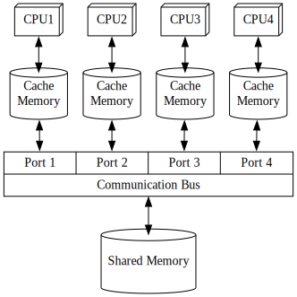

# ReLM Introduction

ReLM = Register-Less Multiprocessor

ReLM is the soft-core multiprocessor technology based on the unique memory architecture, enabling users to build a high-performance microcontroller on a relatively small FPGA board.

The most annoying task in developing on a FPGA board is logic synthesis, however, is not required for changing applications (software) with ReLM architecture.  
This advantage of ReLM supports users in easily designing circuits on a FPGA board.  
In the developing process, ReLM also enables debugging by loading applications from a host PC to the fixed circuit on the FPGA board, and finally realizes a stand-alone microcontroller, once the loaded application is fixed.  
Furthermore, ReLM with optimized circuit can be applied to ASIC development.

## Ordinary technique: Arbitration by cache memory

The latest PCs and mobile devices require certain performance of their processors and so usually have them in multicore structure.  
These devices have the OS and applications placed in their shared memories consisting of large-capacity SDRAM and so on, and therefore, each processor-core requires a copy of necessary data in its correspondent [cache memory](https://en.wikipedia.org/wiki/CPU_cache) to use in order to avoid "[Von Neumann bottleneck](https://en.wikipedia.org/wiki/Von_Neumann_architecture#Von_Neumann_bottleneck)."

There's no need to pay attention to cache memory in software operation, letting users program so conveniently as if the programs were running on a huge lump of shared memory.

The cost of this convenience, however, weighs heavily on hardware.  
Cache memories occupy the largest part of processor circuits and increases electricity consumption accordingly, while giving users no benefit of direct use.  
Specially in such a case that a couple of cache memories hold overlapping copies of part of the shared memory, it requires a complicated processing mechanism to sustain "[memory coherence](https://en.wikipedia.org/wiki/Memory_coherence)."  
After all, this technique basically assumes an external large shared memory, being dedicated to relatively large-scale systems.

<dl>
<dt>Pros</dt>
<dd>Easy access to shared memory</dd>
<dt>Cons</dt>
<dd>Complicated access arbitration mechanism</dd>
<dd>Dedicated to relatively large-scale systems</dd>
</dl>

## Ordinary technique: Scratchpad

Some multiprocessors which need higher efficiency and performance for specific purposes employ local store or "[Scratchpad memory](https://en.wikipedia.org/wiki/Scratchpad_memory)," relatively small and fast memory area split and dedicated to each processor-core.

This technique requires special tactics in algorithm development for parallel processing due to the need of using memory area invisible from other cores and threads in software operation.

This technique helps hardware to simplify configuration with no need for a complex access arbitration mechanism indispensable in using shared memory and cache memories.  
Practically, however, it requires some inter-processor communication method.  
SPE of [Cell/B.E.](https://en.wikipedia.org/wiki/Cell_(processor)), as a typical example, dedicates memory access to local storage while relying on DMA transfer to main memory for external communication, which turns into a serious impairment in practice.

<dl>
<dt>Pros</dt>
<dd>No need for a complex access arbitration mechanism</dd>
<dd>Available for relatively small systems</dd>
<dt>Cons</dt>
<dd>Increasingly complex software in order to manage relatively small local memories</dd>
<dd>No access or only indirect complicated access to shared memory available</dd>
</dl>

## New technique: ReLM architecture

Now, is such an ideal memory architecture for multiprocessors feasible that meets below-mentioned requirements?

* No need for a complex access arbitration mechanism
* Good operability in using shared memory
* Available for relatively small systems

In fact, these requirements are achievable by multiprocessor unique in architecture with below-mentioned features.

* Memory banks divided from shared memory by lower bits of addresses and directly connected to corresponding processor-cores.
* Simultaneous fetch and execution of instructions at all processor-cores, proceeding to all-out transfer of the entire internal state of every processor in the form of chain bus connection.
* Sustained instruction execution by all threads circulating through annularly connected processors.

The main feature of this architecture is inter-core transfer of processors' internal state done at every instruction execution, which is so unachievable by conventional techniques of processor architecture.

The ReLM architecture has challenged these almost impossible missions and realized them in a practical manner.

* Ordinary "[instruction pipelining](https://en.wikipedia.org/wiki/Instruction_pipelining)" usually employed by conventional processors has internal state too complicated to be transferred.
  * In the ReLM architecture, every instruction is executed in one cycle.
* There is a question about the need for arbitration in case that reading and writing memory data occurs separately from regular execution even though ReLM enables simultaneous access for instruction fetch.
  * ReLM architecture makes no distinction between instruction fetch and data access.
  * ReLM architecture enables reading and writing operands in arbitrary address of code memory.
* In the ReLM architecture, the internal state includes a whole "[register file](https://en.wikipedia.org/wiki/Register_file)," resulting in increasing transfer load according to the number of registers.
  * ReLM architecture essentially limits registers to the [accumulator](https://en.wikipedia.org/wiki/Accumulator_(computing)) and other minimal usage.
  * Practically, operands of code memory play the act of registers, so there is no need for many registers.

## Pipelined thread execution

On hardware with ReLM architecture, each CPU relays the role of thread execution (that is transfer of the whole internal state) to another CPU at every instruction execution, which looks, as viewed from the thread in execution, as if a CPU kept [switching memory banks](https://en.wikipedia.org/wiki/Bank_switching) one after another.

In the mechanism where the subject CPU always has access only to a memory bank with lower bits corresponding to its execution address, an instruction execution triggers an [increment](https://en.wikipedia.org/wiki/Increment_and_decrement_operators) in [program counter](https://en.wikipedia.org/wiki/Program_counter) and CPUs' relay, enabling the next subject CPU to fetch and execute a new instruction.

The challenge here is how to write the result of instruction execution to shared memory.

Take a case of writing the result of instruction execution done at CPU #0 back to Memory Bank #3, which is a little away and so inaccessible from CPU #0.

To enable direct writing-back, it will require additional signal wiring of enormous quantity due to the combination number of CPUs and memory banks in addition to the need of a very complicated arbitration mechanism, ruining all benefits of the simple memory architecture.

Instead, suspending writing-back until the relay of CPUs would bring no problem in the context of the written result practically dedicated to the same thread.  
Memory Bank #3 needs to have the result written back to itself just before CPU #3 fetches an instruction from the Memory Bank #3.  
Surely it is lazy updating memory from other threads' viewpoint, though, it is just a CPU-circle-long latency and within the permissible range as inter-thread communication overhead.

In hardware implementation, this mechanism easily comes true just by including info on lazy write back in processors' internal state.

The internal state of a processor consists of below-mentioned elements.
* Register File (Reg)
* Program Counter (PC)
* Lazy Write Back Info (WriteBack)

Shown below is a datapath of thread execution at a circular pipeline consisting of 4 CPUs.

Information for lazy write back is divided to correspond to each memory bank, and the write back is done at the same time of operand readout.  
The readout of operation code (OpCode) also coincides with them, while other information is delayed one clock by [flip flop](https://en.wikipedia.org/wiki/Flip-flop_(electronics)#D_flip-flop) (FF).

As operands include data only as [immediate](https://en.wikipedia.org/wiki/Addressing_mode#Immediate/literal) values, a CPU has all requirements for calculation at the time of fetching an instruction to execute, which is to be touched upon in the page of "Instruction Set."  
Therefore, all instructions can be completed only with one-clock delay by making CPU's execution unit a [combinational logic](https://en.wikipedia.org/wiki/Combinational_logic) to get no clock delay.

