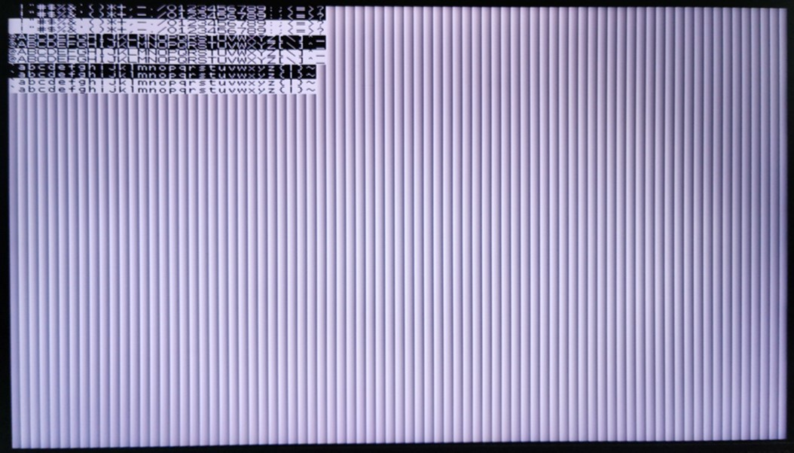

# ReLM development environment

## Development language

* Python
  * Write applications in DSL on Python to generate binary code for ReLM architecture.
  * During development, a complete circuit helps to focus on software update free from troublesome logic synthesis.
    * In Intel (ALTERA) environment, the USB Blaster is controlled via DLL functions.
  * While the newer the better, Python 3.8 or later is necessary to use ["the walrus operator :="](https://docs.python.org/3/whatsnew/3.8.html).
* Verilog HDL
  * Used in logic synthesis for FPGA.
  * Also used in writing custom logic for peripheral device interface and custom extension instructions.

## Development tools

* Quartus Prime
  * Required for logic synthesis for Intel (ALTERA) FPGA.
  * Attached USB Blaster driver also needs to be installed for communication with Python.
  * Lite Edition basically meets requirements for development, though depending on the scale of FPGA.
* Visual Studio Code (recommended)
  * Both Python and Verilog HDL are supported with plugins.
  * Launching Python code is relatively easy.
  * [GitHub Copilot](https://github.com/features/copilot) is available.
    * More ReLM-related code examples are awaited to improve prediction accuracy.

## Target FPGA board

* [Terasic DE0-CV Board](https://www.terasic.com.tw/cgi-bin/page/archive.pl?Language=English&CategoryNo=183&No=921)
  * FPGA: Cyclone V 5CEBA4F23C7N
  * 8 core composition is available.
    * 16 core composition is possible, but little room for LE.
  * PS/2 port
  * VGA output
  * ___Out of production, unfortunately.___ On the way to switching to the next target.

* [Terasic Cyclone V GX Starter Kit](https://www.terasic.com.tw/cgi-bin/page/archive.pl?Language=English&CategoryNo=167&No=830)
  * FPGA: Cyclone V GX 5CGXFC5C6F27C7N
  * 16 core composition is available.
  * HDMI output
  * Audio input & output
  * Arduino header
    * Scheduled to support USB devices via USB Host Shield.
  * Micro SD Card
    * Planned for use in AI applications.
  * ___Targeted as the next main board.___

## File Components

* relm.v  
_ReLM architecture basic circuit implementation_
* relm_custom_none.v  
_Custom instruction (empty or template)_
* relm_custom_div.v  
_Custom instruction (integer division)_
* relm_custom_div_fp.v  
_Custom instruction (integer division and floating point arithmetic)_
* relm.py  
_Python DSL basic library_
* relm_jtag.py  
_USB Blaster communication-related_
* __de0cv (folder)__  
_DE0-CV target-related_
  * __relm_de0cv.py__  
  _DE0-CV device drivers (loader generator)_
  * relm_font.py  
  _Console-output-related_
  * relm_de0cv.v  
  _DE0-CV top module_
  * relm_de0cv.sdc  
  _Clock frequency specification_
  * __loader (folder)__  
  _Loader-related during development_
    * __relm_de0cv.qpf__  
    _Quartus Prime Project (loader configuration)_
    * relm_de0cv.qsf  
    _Quartus Prime project settings_
    * __relm_test_led.py__  
    _LED test (via loader)_
    * __relm_test_ps2.py__  
    _PS/2 communication test (via loader)_
    * __relm_test_vga.py__  
    _VGA display test (via loader)_
  * __bubble (folder)__  
  _Playable PoC game app related_
    * __relm_bubble.py__  
    _Playable PoC sample game app "Bubble Estate"_
    * __relm_bubble_release.py__  
    _Memory image generation for standalone configuration release_
    * __relm_de0cv.qpf__  
    _Quartus Prime project (standalone configuration)_
    * relm_de0cv.qsf  
    _Quartus Prime project settings_

## Building loader environment

Here it goes as follows to explain development work procedure using the DE0-CV target as an example.

On running __relm_de0cv.py__ in the de0cv folder, code data output __code??.txt__ and __data??.txt__ are created in the de0cv/loader folder.

Open the Quartus Prime project file __relm_de0cv.qpf__ in the same folder as the code data output, and perform logic synthesis to generate a ReLM environment implementing the program loader. (Required settings are already saved in relm_de0cv.qsf)

The generated ReLM environment is saved in the __loader/output_files__ folder as the following FPGA configuration file.
* __relm_de0cv.sof__  
_SOF file for configuring FPGA in Quartus Prime_
* __relm_de0cv.pof__  
_POF file for writing the circuit to the on-board ROM in Quartus Prime and configuring it at power-on_
* __relm_de0cv.svf__  
_SVF file for direct configuration in ReLM environment_

While being the most standard configuration files, SOF files are somewhat inconvenient for developing in the ReLM environment, always requiring the use of Quartus Prime each time.

Configuration by SVF file is the easiest to use in the ReLM environment.  
Even if the ROM on the board contains a completely different circuit, loading the SVF file enables FPGA to automatically reset and invoke with the ReLM loader environment, as is very convenient __without corrupting the ROM contents.__

On start-up by SVF file, configuration takes several seconds, possibly needing efficiency improvement when the work gets to a climax.

In such a case, rewriting the ROM on the board by POF file enables the loader environment to start up immediately at power on, reducing the waiting time on booting.  
Please refer to the FPGA board manual for rewriting the ROM by POF file.

POF files are so useful not only for loader environment but also for releasing standalone configurations.  
Writing to the ROM on the FPGA board enables applications in the ReLM environment to boot without a host PC.

## ReLM startup sequence

This section explains the startup sequence at power on, showing the debugging dump output when outputting code data.

Since the DE0-CV target has an 8-core configuration, the first 8 words are the entry points for all 8 threads.

~~~
0000:   JUMP    0000:                   202:    with ReLMLoader(__file__, "..", "loader", release_loader=True):
0001:   JUMP    0001:                   202:    with ReLMLoader(__file__, "..", "loader", release_loader=True):
0002:   JUMP    0002:                   202:    with ReLMLoader(__file__, "..", "loader", release_loader=True):
0003:   JUMP    0003:                   202:    with ReLMLoader(__file__, "..", "loader", release_loader=True):
0004:   JUMP    0004:                   202:    with ReLMLoader(__file__, "..", "loader", release_loader=True):
0005:   JUMP    0005:                   202:    with ReLMLoader(__file__, "..", "loader", release_loader=True):
0006:   JUMP    0006:                   202:    with ReLMLoader(__file__, "..", "loader", release_loader=True):
0007:   JUMP    0008:                   126:    Loader[
~~~

The first 7 threads with the entry point addressed from 0 to 6 are to jump to their own entry points again, and so will be in a dormant state.

The last thread with the entry point addressed 7 is to jump to address 8, and the rows addressed 8 and after deployed program loader code, turning out the program loader being executed in the thread.

~~~
0008:   IN      JTAG                    128:    Out("PUTOP", In("JTAG")),
0009:   BLOAD   PUTOP                   128:    Out("PUTOP", In("JTAG")),
000A:   OPB     OUT                     128:    Out("PUTOP", In("JTAG")),
000B:   OPB     LOAD                    129:    If(RegB & 0xC00000 != 0)[
000C:   AND     00C00000                129:    If(RegB & 0xC00000 != 0)[
000D:   JEQ     0013:                   129:    If(RegB & 0xC00000 != 0)[
000E:   AND     00800000                130:    (Acc & 0x800000).opb("JEQ"),
000F:   OPB     JEQ                     130:    (Acc & 0x800000).opb("JEQ"),
0010:   LOAD    00000000                131:    (+operand).opb("PUT"),
0011:   OPB     PUT                     131:    (+operand).opb("PUT"),
0012:   JUMP    0008:                   132:    Continue(),
0013:   LOAD    00000000                134:    operand(operand << 16 | RegB),
0014:   MUL     00010000                134:    operand(operand << 16 | RegB),
0015:   OPB     OR                      134:    operand(operand << 16 | RegB),
0016:   PUT     0010:                   131:    ->      (+operand).opb("PUT"),
0017:   PUT     0013:                   134:    ->      operand(operand << 16 | RegB),
0018:   JUMP    0008:                       DoLoop
~~~

The left half of each row shows assembly code, while the right half shows the corresponding row of Python source code.

The following Python code shows the source code for the program loader part (relm_de0cv.py), which first inputs data from "JTAG" and outputs it to "PUTOP".

~~~ py
operand = Int()
Loader[
    Do()[
        Out("PUTOP", In("JTAG")),
        If(RegB & 0xC00000 != 0)[
            (Acc & 0x800000).opb("JEQ"),
            (+operand).opb("PUT"),
            Continue(),
        ],
        operand(operand << 16 | RegB),
    ],
]
del operand
~~~

This "PUTOP" is the port number of the device the program loader uses to rewrite instruction code (OpCode), and is a function to be removed at release after development.

To improve the readability of assembly code, I/O port number and instruction code are specified by string and are converted to actual numerical code when written to memory.

RegB and Acc are [intrinsics](https://en.wikipedia.org/wiki/Intrinsic_function) for directly accessing the registers of the ReLM architecture, but this is an optimization to make the program loader code as compact as possible, and this technique is not always necessary at the normal application level.

The code data shown above is a memory image with only this program loader running.

The program loader running in the ReLM environment on the FPGA can rewrite instruction code (OpCode) and its operand at any address.  
So, the loader can fill in program code after the loader at the address 0x19 and the following from the host PC via JTAG.  
And afterwards, rewrite the operands of the thread entry (addressed from 0 to 7) to finally boot the threads.

By using this program loader environment, it is possible to proceed with application software development work with no need for troublesome logic synthesis.

As the loader folder contains sample code for checking operation, let's use it to explain how to write an application using Python code.

## Test code: LED lighting and button input (relm_test_led.py)

First try running relm_test_led.py with the FPGA board connected.

Show console output

~~~
0000:   JUMP    0019:                   9:      Thread[
0001:   JUMP    0001:                   8:      with ReLMLoader(loader="loader/output_files/relm_de0cv.svf"):
0002:   JUMP    0002:                   8:      with ReLMLoader(loader="loader/output_files/relm_de0cv.svf"):
0003:   JUMP    0003:                   8:      with ReLMLoader(loader="loader/output_files/relm_de0cv.svf"):
0004:   JUMP    0004:                   8:      with ReLMLoader(loader="loader/output_files/relm_de0cv.svf"):
0005:   JUMP    0005:                   8:      with ReLMLoader(loader="loader/output_files/relm_de0cv.svf"):
0006:   JUMP    0006:                   8:      with ReLMLoader(loader="loader/output_files/relm_de0cv.svf"):
0007:   JUMP    0008:                   6:      from relm_de0cv import *
0008:   IN      JTAG                    6:      from relm_de0cv import *
0009:   BLOAD   PUTOP                   6:      from relm_de0cv import *
000A:   OPB     OUT                     6:      from relm_de0cv import *
000B:   OPB     LOAD                    6:      from relm_de0cv import *
000C:   AND     00C00000                6:      from relm_de0cv import *
000D:   JEQ     0013:                   6:      from relm_de0cv import *
000E:   AND     00800000                6:      from relm_de0cv import *
000F:   OPB     JEQ                     6:      from relm_de0cv import *
0010:   LOAD    00000000                6:      from relm_de0cv import *
0011:   OPB     PUT                     6:      from relm_de0cv import *
0012:   JUMP    0008:                   6:      from relm_de0cv import *
0013:   LOAD    00000000                6:      from relm_de0cv import *
0014:   MUL     00010000                6:      from relm_de0cv import *
0015:   OPB     OR                      6:      from relm_de0cv import *
0016:   PUT     0010:                   6:      ->      from relm_de0cv import *
0017:   PUT     0013:                   6:      ->      from relm_de0cv import *
0018:   JUMP    0008:                       DoLoop
0019:   LOAD    LED1                    10:     LED(
001A:   OUT     7DDB4B4B                10:     LED(
001B:   LOAD    LED0                    10:     LED(
001C:   OUT     EF030000                10:     LED(
001D:   IN      KEY                     19:     key := Int(In("KEY")),
001E:   PUT     0020:                   20:     ->      Out("LED0", ((key & 0b11111) ^ (key >> 5)) * 2 + 1),
001F:   PUT     0022:                   20:     ->      Out("LED0", ((key & 0b11111) ^ (key >> 5)) * 2 + 1),
0020:   LOAD    00000000                20:     Out("LED0", ((key & 0b11111) ^ (key >> 5)) * 2 + 1),
0021:   AND     0000001F                20:     Out("LED0", ((key & 0b11111) ^ (key >> 5)) * 2 + 1),
0022:   BLOAD   00000000                20:     Out("LED0", ((key & 0b11111) ^ (key >> 5)) * 2 + 1),
0023:   SAR     00000020                20:     Out("LED0", ((key & 0b11111) ^ (key >> 5)) * 2 + 1),
0024:   OPB     XOR                     20:     Out("LED0", ((key & 0b11111) ^ (key >> 5)) * 2 + 1),
0025:   MUL     00000002                20:     Out("LED0", ((key & 0b11111) ^ (key >> 5)) * 2 + 1),
0026:   ADD     00000001                20:     Out("LED0", ((key & 0b11111) ^ (key >> 5)) * 2 + 1),
0027:   BLOAD   LED0                    20:     Out("LED0", ((key & 0b11111) ^ (key >> 5)) * 2 + 1),
0028:   OPB     OUT                     20:     Out("LED0", ((key & 0b11111) ^ (key >> 5)) * 2 + 1),
0029:   JUMP    001D:                       DoLoop
SVF configuration: loader/output_files/relm_de0cv.svf
IDCODE: 2B050DD
..................................................
.
Loading instructions...
IDCODE: 2B050DD
42 / 65536 instructions (0.1 % used)
~~~

 

Upon the successful startup, the PC console will display the above dump output, and the LED on the FPGA board will show "HELLO_".  
Pressing the buttons or changing the switches on the FPGA board will change the LED accordingly.

Unfortunately, the source code for the loader part is shown like "from relm_de0cv import *" in the dump output, while the output shows that the user code is loaded to 0x19 and its following addresses and the thread has booted from address 0.

The Python source code is below.

~~~ py
with ReLMLoader(loader="loader/output_files/relm_de0cv.svf"):
    Thread[
        LED(
            hex5=0b0111110,  # H
            hex4=0b1101101,  # E
            hex3=0b0100101,  # L
            hex2=0b0100101,  # L
            hex1=0b1110111,  # O
            hex0=0b0000001,  # _
        ),
        Do()[
            key := Int(In("KEY")),
            Out("LED0", ((key & 0b11111) ^ (key >> 5)) * 2 + 1),
        ],
    ]
~~~

ReLMLoader offers the option of action by entering the value of the named argument **loader**, but here we are specifying the relative path of a SVF file.

On specifying the SVF file to the argument **loader**, the board is reset and has the loader environment configured, and then this loader environment brings the loading and booting of a program.

Note that the relative path for specifying the SVF file is based on the folder de0cv, which includes relm_de0cv.py (not the application code folder).

In the case of specifying the argument as **loader=True** or deleting the SVF file (a warning message appears), if the loader environment is already saved in the ROM on the FPGA board, that loader environment in the ROM enables loading a program without configuration of the loader environment by SVF file.

In the case of specifying the argument as **load=False**, only the dump output will be displayed without loading a program.  
Since the FPGA board is not accessed in this option, it is available for such use as just checking by dump output with no problem even when a program is not completed yet and the board is not connected.

ReLM application code is basically written within the "with" block of ReLMLoader.

Code sent to the FPGA is written in __Thread[ ]__ or __Define[ ]__ blocks, and the corresponding thread is started for each __Thread[ ]__ block.

Definitions of array data and function objects referred after are written in the __Define[ ]__ block.

To develop a [domain-specific language](https://en.wikipedia.org/wiki/Domain-specific_language) within the regular Python syntax, code blocks are written as sequences of comma-separated expressions, like the elements of an array.

To handle such unfamiliar notation, it is encouraged to use a code formatting tool. (Here, [Black Formatter](https://black.readthedocs.io/en/stable/) in Visual Studio Code environment is used.)

This notation requires all executable statements to be available for evaluation as expressions.

The usual assignment statement in Python __[ variable_name = expression ]__ cannot be evaluated as an expression.  
Therefore, in the case of variable definition, the [:= operator](https://docs.python.org/3/whatsnew/3.8.html) is used as __[ variable_name := expression ]__.  
Assignments to existing variables without definitions are denoted with parentheses like __[ variable_name( expression ) ]__.

In the above example, the following Python code defines and initializes a signed integer type (Int) variable named "key".
~~~ py
            key := Int(In("KEY")),
~~~

This assembly code output is extended into the following three rows: acquisition of the button state from the I/O port and two PUT instructions.
~~~
001D:   IN      KEY                     19:     key := Int(In("KEY")),
001E:   PUT     0020:                   20:     ->      Out("LED0", ((key & 0b11111) ^ (key >> 5)) * 2 + 1),
001F:   PUT     0022:                   20:     ->      Out("LED0", ((key & 0b11111) ^ (key >> 5)) * 2 + 1),
~~~

The reason of two PUT instructions here is because the "key" is referenced in two places, and the entity of the Int type variable is actually the operands in all the reference places.
~~~ py
            Out("LED0", ((key & 0b11111) ^ (key >> 5)) * 2 + 1),
~~~

As mentioned in the program loader code, __Do() [__ _block_ __]__ results in an infinite loop.

It turns into a normal do-while statement by adding an escape condition with __Do()[__ _block_ __].While(__ _conditional_expression_ __)__.

## Test code: PS/2 keyboard input (relm_test_ps2.py)

Just to be safe, connect the keyboard to the PS/2 port with the FPGA board powered off.

Power on the FPGA board and run **relm_test_ps2.py**.

The successful startup will display "PS2PS2" on the LED, the LED on the PS/2 keyboard will light up, and by pressing the keyboard, the LED will blink according to the key code.

The Python code will look like this:

Show Python code

~~~ py
with ReLMLoader(loader="loader/output_files/relm_de0cv.svf"):
    Define[
        # sendPS2 := SendPS2(),
        sendPS2 := Function(data := Int())[
            IO("PS2", 0x80000001),
            Acc(1 - (-100 * 1000) // (20 * ReLM.ncpu)),  # 100us
            Do()[...].While(Acc - 1 != 0),
            IO("PS2", 0x40000000),
            data & 0xFF,
            IO("PS2", 0x0, load="BLOAD"),
            IO("PS2", RegB | 0x40000000),
            IO("PS2", RegB),
            IO("PS2", (RegB >> 1) | 0x40000000),
            IO("PS2", RegB >> 1),
            IO("PS2", (RegB >> 2) | 0x40000000),
            IO("PS2", RegB >> 2),
            IO("PS2", (RegB >> 3) | 0x40000000),
            IO("PS2", RegB >> 3),
            IO("PS2", (RegB >> 4) | 0x40000000),
            IO("PS2", RegB >> 4),
            IO("PS2", (RegB >> 5) | 0x40000000),
            IO("PS2", RegB >> 5),
            IO("PS2", (RegB >> 6) | 0x40000000),
            IO("PS2", RegB >> 6),
            IO("PS2", (RegB >> 7) | 0x40000000),
            IO("PS2", RegB >> 7),
            RegB((RegB >> 1) ^ RegB),
            RegB((RegB >> 2) ^ RegB),
            RegB((RegB >> 4) ^ RegB),
            IO("PS2", RegB ^ 0x40000001),
            IO("PS2", RegB ^ 0x1),
            IO("PS2", 0x40000001),
            IO("PS2", 0x1),
            IO("PS2", 0x40000001),
        ],
        # recvPS2 := RecvPS2(),
        recvPS2 := Function()[
            Do()[IO("PS2", 0x40000001),].While(IO("PS2", 0x1) != 0),
            IO("PS2", 0x40000001),
            IO("PS2", 0x1),
            IO("PS2", 0x40000001, load="BLOAD"),
            (IO("PS2", 0x1) << 1) | RegB,
            IO("PS2", 0x40000001, load="BLOAD"),
            (IO("PS2", 0x1) << 2) | RegB,
            IO("PS2", 0x40000001, load="BLOAD"),
            (IO("PS2", 0x1) << 3) | RegB,
            IO("PS2", 0x40000001, load="BLOAD"),
            (IO("PS2", 0x1) << 4) | RegB,
            IO("PS2", 0x40000001, load="BLOAD"),
            (IO("PS2", 0x1) << 5) | RegB,
            IO("PS2", 0x40000001, load="BLOAD"),
            (IO("PS2", 0x1) << 6) | RegB,
            IO("PS2", 0x40000001, load="BLOAD"),
            (IO("PS2", 0x1) << 7) | RegB,
            IO("PS2", 0x40000001, load="BLOAD"),
            IO("PS2", 0x1),
            IO("PS2", 0x40000001),
            IO("PS2", 0x1),
            IO("PS2", 0x40000001),
        ].Return(RegB),
    ]
    Thread[
        LED(
            hex5=0b1111100,  # P
            hex4=0b1101011,  # S
            hex3=0b1011101,  # 2
            hex2=0b1111100,  # P
            hex1=0b1101011,  # S
            hex0=0b1011101,  # 2
        ),
        sendPS2(0xED),  # Keyboard LED command
        sendPS2(0x7),  # Keyboard LED command
        # sendPS2(0xF4),  # Mouse Enable
        Do()[Out("LED0", recvPS2() * 2 + 1),],
    ]
~~~

 

Two function objects (Function) are defined in the __Define[ ]__ block before the __Thread[ ]__ block.

Likewise, the __Define[ ]__ block is used to define objects such as functions or arrays that will be referenced later without starting a thread.

The beginning of the sendPS2 function definition that sends data to the PS/2 port is as follows.

~~~ py
        sendPS2 := Function(data := Int())[
            IO("PS2", 0x80000001),
            Acc(1 - (-100 * 1000) // (20 * ReLM.ncpu)),  # 100us
            Do()[...].While(Acc - 1 != 0),
~~~

In the function definition, put the definition of the Int type variable in the parameter, and then write the code that references the parameter in the function body.

Here, the process is to drop the clock signal to "Low" level and wait 100 microseconds at the start of PS/2 transmission, but the number of loops for waiting time is calculated using a normal Python formula, and the result is assigned to the accumulator (Acc).

In the following row, the body of the Do-While loop contains an Ellipsis (...).  
But this is a dummy object just to fill the block, because Python's syntax does not allow to leave the block empty.

Any other object than a "Statement" type (defined in relm.py) in a block will be ignored during code generation, so placing "None" or a numerical value such as 0 will have the same effect.  
Use __Acc(__ _number_ __)__ to assign a number to the accumulator instead of just putting the number, which brings nothing.

The following code is to call a function;
~~~ py
        sendPS2(0xED),  # Keyboard LED command
~~~

The assembly code output for this part is as follows, and is expanded into the code that assigns 0xED the parameter variable, puts the return address (0xB4 in the following example) into the accumulator, and jumps to the function entry point.
~~~
00BC:   LOAD    000000ED                78:     sendPS2(0xED),  # Keyboard LED command
00BD:   PUT     0021:                   16:     ->      data & 0xFF,
00BE:   LOAD    000000B4                78:     sendPS2(0xED),  # Keyboard LED command
00BF:   JUMP    0019:                   78:     sendPS2(0xED),  # Keyboard LED command
~~~

The return address of the function is optimized to reduce the penalty of waiting for rotation, so the code will not necessarily be placed consecutively.

The recvPS2 function returns the result at the end of the body;
~~~ py
        recvPS2 := Function()[
        ...
        ].Return(RegB),
~~~
So, the result can be called and referenced inside an expression.
~~~ py
        Do()[Out("LED0", recvPS2() * 2 + 1),],
~~~

## Test code: VGA display output (relm_test_vga.py)

**relm_test_vga.py** is a relatively complex sample that outputs characters to the screen using VGA.

The first thread is to implement VRAM features.
~~~ py
    Thread[
        Acc("VGA"),
        Do()[vram := Array(*([0xFEDCBA98] * 80 * 480))],
    ]
~~~

The array object, defined here as VRAM, is actually a chunk of PUSH instructions.

The thread generates video signals by assigning FIFO port number for VGA output to the accumulator value and continuing to run the PUSH command loop.

[Indexed color](https://en.wikipedia.org/wiki/Indexed_color) with 4 bits per pixel (16 colors) is employed to fit the VRAM within 65536 words of the DE0-CV target's code memory.

Still, 640 x 480 pixels on VGA requires 80 x 480 = 38400 words, resulting in VRAM to occupy more than half of the code memory.

Since Array objects can become huge like this, debug dump output is suppressed to the first 10 elements.

Then, a console object and the startup of the service thread come next.

~~~ py
    console = Console(vram, 80, FIFO.Alloc(), FIFO.Alloc())
    Thread[console.Service()]
~~~

FIFO.Alloc() allocates two FIFOs, one for communicating font data and the other for communicating with the main thread.  
The implementation part of the service thread is in relm_font.py.

~~~ py
    def Service(self) -> Block:
        return Block[
            pos := Int(),
            color_fg := Int(),
            color_bg := Int(),
            self.fifo_font.Lock(),
            self.fifo_print.Lock(),
            Do()[
                If(RegB(self.fifo_print.Pop(), 0x80000000).opb("AND") == 0)[
                    text := Int(RegB),
                    While(text != 0)[
                        self.PutChar(pos, text & 0x7F, color_fg, color_bg),
                        pos(pos + 1),
                        text(text >> 8),
                    ],
                    Continue(),
                ],
                If(RegB & 0x40000000 == 0)[pos(RegB & 0x3FFFFFFF), Continue()],
                bg := Int(RegB & 0xF),
                color_bg(Acc * 0x11111111),
                color_fg(((RegB & 0xF0) >> 4) - bg),
            ],
        ]
~~~

Likewise, preparing a Python function to return a "Block" object or "Function" object and calling it inside a "Thread" block or "Define" block enable code expansion as needed.

The following is part of the color palette settings and string output processing in the main thread.

~~~ py
        Out("VGAPAL", *[i * 0x1111 for i in range(16)]),
        console.Print(" !\"#$%&'()*+,-./0123456789:;<=>?", pos=0, color=0xF0),
~~~

Writing fonts to VRAM on outputting strings and reading VRAM for FIFO output are executed in separate threads, but parallel processing is possible without intentionally mutual exclusion.
